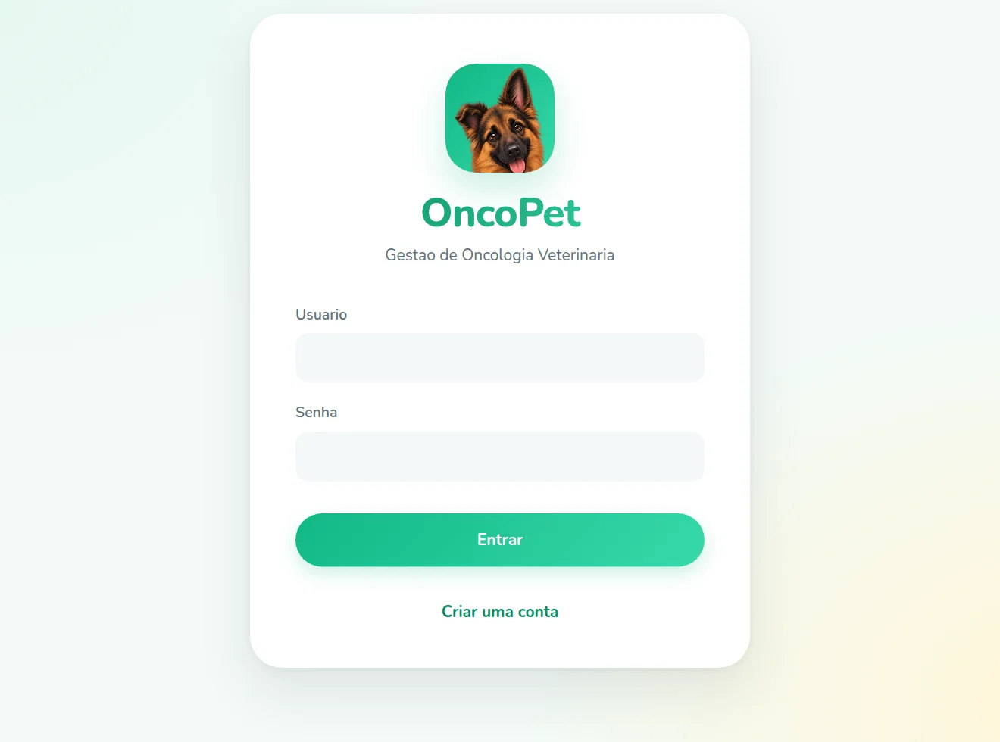
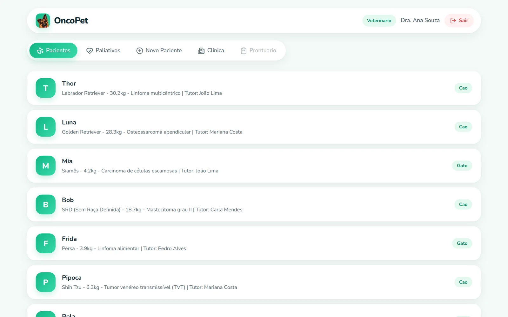
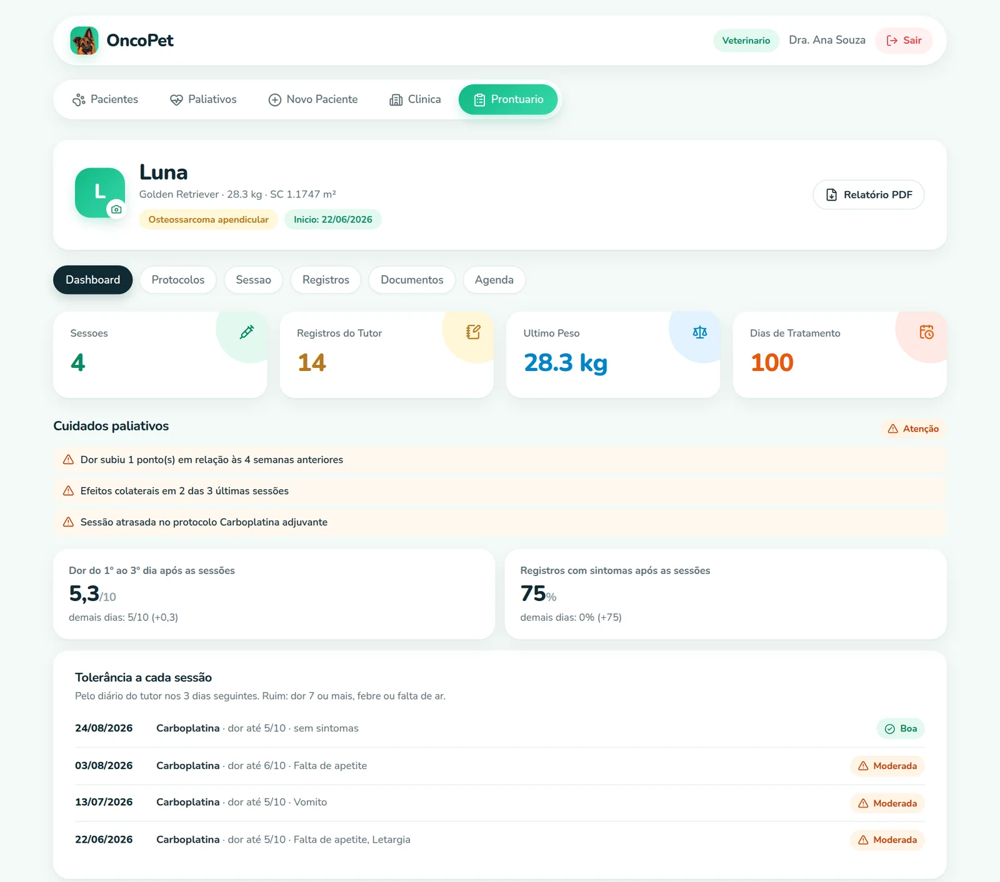
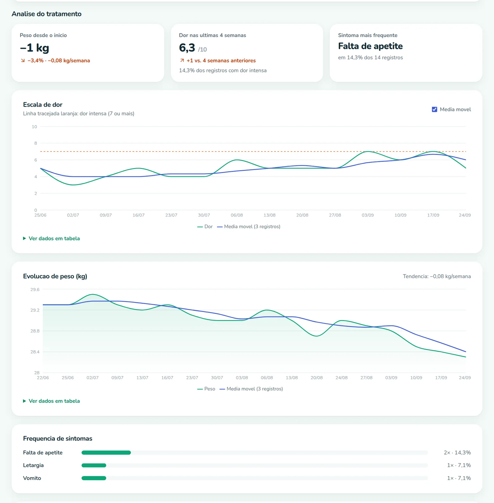
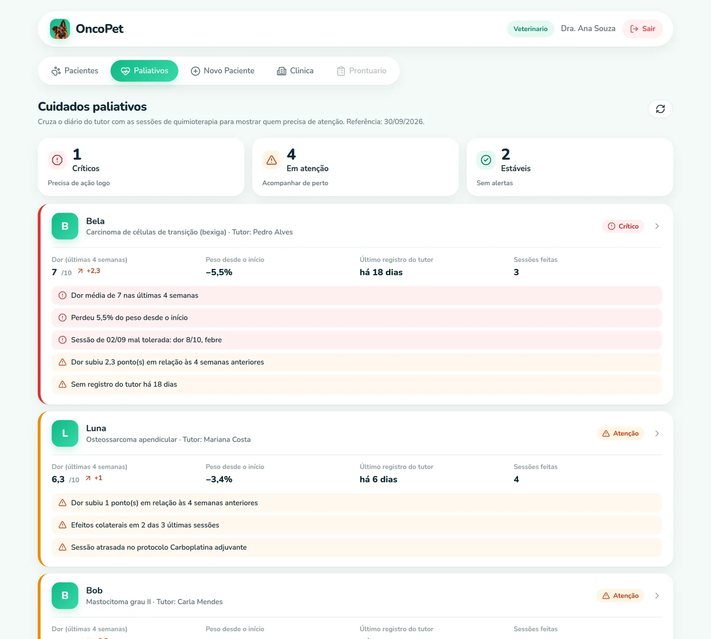
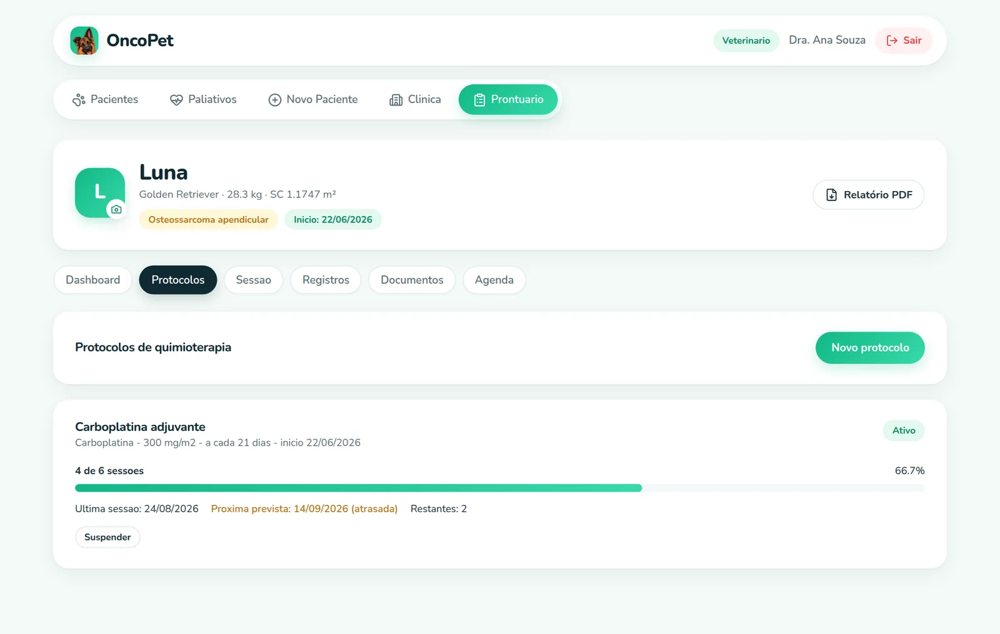
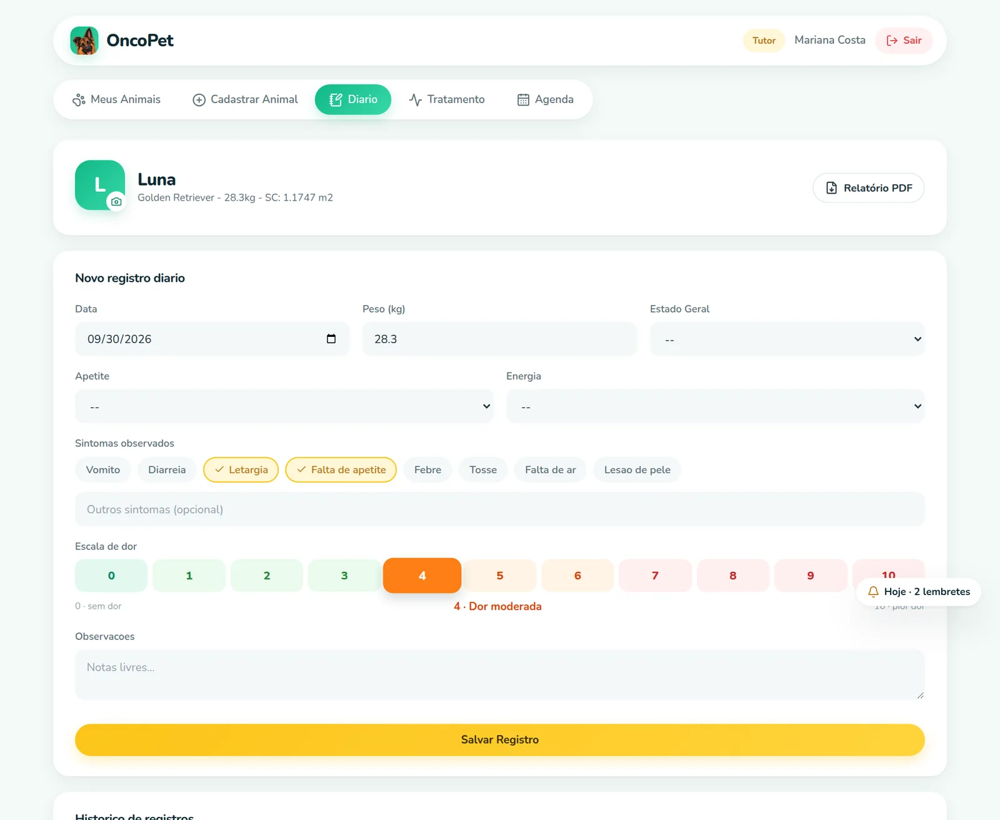
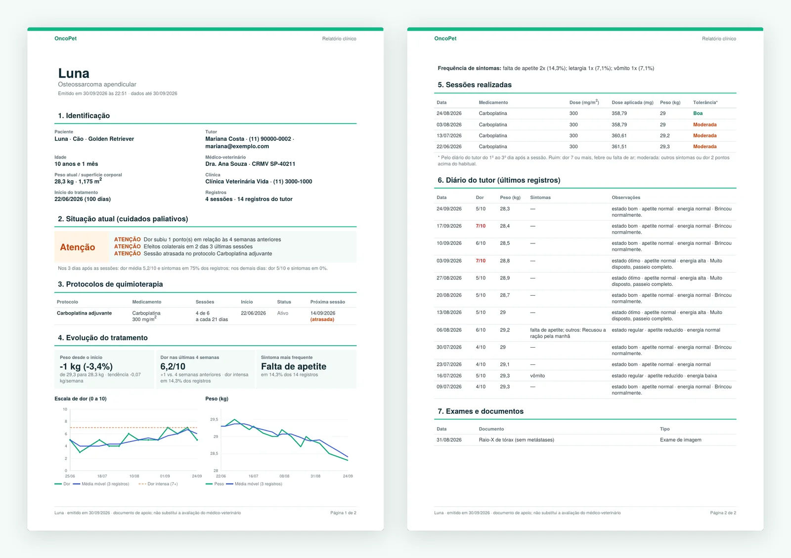
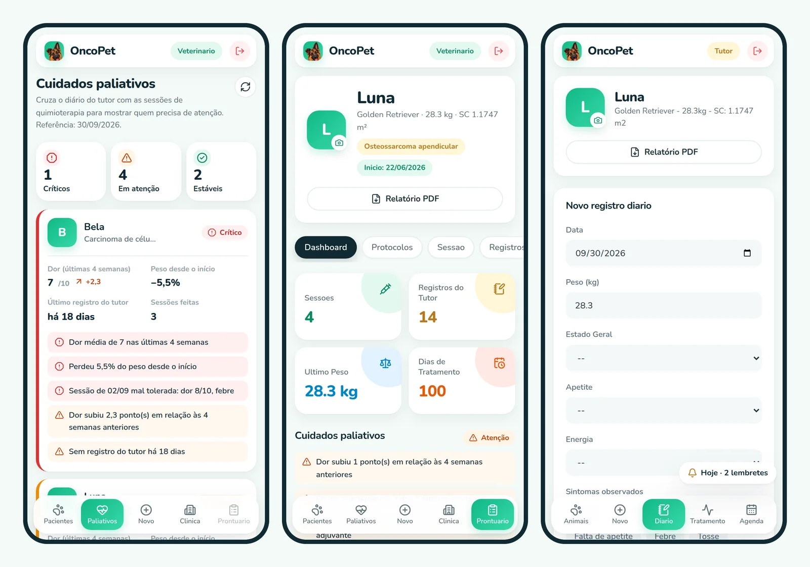
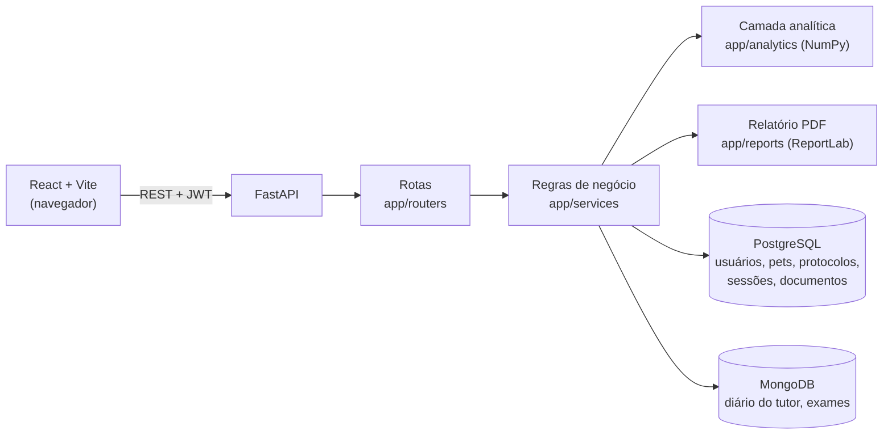

<div align="center">


# OncoPet

**Acompanhamento de quimioterapia veterinária, do consultório até a casa do tutor.**


</div>

O OncoPet conecta o **médico-veterinário** e o **tutor** durante o tratamento oncológico de cães e gatos. O veterinário registra protocolos e sessões de quimioterapia, com a dose calculada pela superfície corporal. O tutor anota em casa como o pet está: peso, sintomas e escala de dor. O sistema cruza essas duas fontes para mostrar a evolução do tratamento, avisar quando algo precisa de atenção e gerar um relatório clínico em PDF.

---

## Sumário

- [Telas](#telas)
- [Funcionalidades](#funcionalidades)
- [Arquitetura](#arquitetura)
- [Como rodar](#como-rodar)
- [Testes](#testes)
- [Estrutura do projeto](#estrutura-do-projeto)
- [Documentação](#documentação)

---

## Telas

> As telas abaixo usam os [dados de demonstração](#dados-de-demonstração) (pacientes e tutores fictícios).

<table>
  <tr>
    <td width="50%"></td>
    <td width="50%"></td>
  </tr>
  <tr>
    <td align="center"><b>Login</b> · acesso do veterinário e do tutor</td>
    <td align="center"><b>Pacientes</b> · todos os pets atendidos pelo veterinário</td>
  </tr>
</table>

### Prontuário do paciente

Resumo do tratamento, alertas de cuidados paliativos e como o pet reagiu a cada sessão de quimioterapia. O botão **Relatório PDF** baixa o prontuário completo.



### Análise do tratamento

Estatísticas calculadas no backend com NumPy: tendência de peso (regressão linear), dor das últimas 4 semanas comparada com as anteriores, média móvel e frequência de sintomas.



### Painel de cuidados paliativos

Os pacientes do veterinário ordenados do mais crítico ao estável. Os alertas vêm do cruzamento entre o diário do tutor (MongoDB) e as sessões de quimioterapia (PostgreSQL).



<table>
  <tr>
    <td width="50%"></td>
    <td width="50%"></td>
  </tr>
  <tr>
    <td align="center"><b>Protocolos</b> · sessões planejadas × executadas e próxima data prevista</td>
    <td align="center"><b>Diário do tutor</b> · peso, sintomas e escala de dor de 0 a 10</td>
  </tr>
</table>

### Relatório clínico em PDF

Junta num documento só os dados do paciente, protocolos, sessões, estatísticas, alertas e o diário do tutor.



### No celular

A navegação vira uma barra inferior, e todas as telas se ajustam à largura do aparelho.



---

## Funcionalidades

| | Veterinário | Tutor |
|---|:---:|:---:|
| Cadastro de pacientes, com foto e recorte | ✅ | ✅ |
| Protocolos de quimioterapia (planejadas × executadas) | cria e acompanha | acompanha |
| Sessões com dose calculada pela superfície corporal | ✅ | |
| Diário: peso, sintomas e escala de dor | vê | registra |
| Estatísticas e gráficos do tratamento | ✅ | |
| Painel de cuidados paliativos | ✅ | |
| Relatório clínico em PDF | ✅ | ✅ |
| Agenda e lembretes do dia | cria | recebe |
| Exames e documentos | anexa e vê | no relatório PDF |

Cada usuário só acessa os pets dele: o tutor vê os próprios animais e o veterinário vê os pacientes atribuídos a ele.

### Requisitos atendidos

| Requisito | Onde |
|---|---|
| **RF-01** Cadastro de pacientes e tutores | `routers/pets.py`, `routers/auth.py` |
| **RF-02 / RF-03** Diário com peso, sintomas e escala de dor no MongoDB | coleção `daily_logs` · [manual](docs/MANUAL_MONGODB.md) |
| **RF-04** Protocolos com sessões planejadas × executadas | `routers/protocols.py`, `services/protocols.py` |
| **RF-05** Estatísticas com NumPy consumidas pelos gráficos | `app/analytics/stats.py` · [manual](docs/MANUAL_NUMPY.md) |
| **RF-06** Painel de cuidados paliativos | `app/analytics/palliative.py` · [manual](docs/MANUAL_PALIATIVO.md) |
| **RF-07** Relatório clínico unificado em PDF | `app/reports/pdf.py` · [manual](docs/MANUAL_RELATORIO.md) |

A análise completa (incluindo os requisitos não funcionais) está em [`docs/ANALISE_REQUISITOS.md`](docs/ANALISE_REQUISITOS.md).

---

## Arquitetura



| Camada | Tecnologia |
|---|---|
| Frontend | React 18 · Vite · React Router · Recharts · lucide-react |
| Backend | Python · FastAPI · SQLAlchemy · Pydantic · Motor |
| Análise | NumPy (operações vetorizadas) |
| Relatórios | ReportLab |
| Bancos | PostgreSQL (dados relacionais) · MongoDB (diário e exames) |
| Autenticação | JWT com os papéis `vet` e `tutor` |
| Testes | pytest · mongomock-motor · `node --test` |

**Por que dois bancos?** Os cadastros têm relações fixas (pet → tutor → veterinário → protocolo → sessões) e ficam no PostgreSQL. O diário do tutor e os exames variam de formato a cada registro, então ficam no MongoDB. Os dois se ligam pelo `id` do pet.

---

## Como rodar

Pré-requisitos: **Docker**, **Python 3.11+** e **Node 18+**.

```bash
# 1. Bancos (PostgreSQL na porta 5433 e MongoDB na 27018)
docker compose up -d

# 2. Backend
cd backend
python -m venv .venv && source .venv/bin/activate
pip install -r requirements.txt
uvicorn app.main:app --reload        # API em http://localhost:8000/docs

# 3. Frontend (em outro terminal)
cd frontend
npm install
npm run dev                          # app em http://localhost:5173
```

As configurações têm valores padrão compatíveis com o `docker-compose.yml`. Para mudar, copie `.env.example` para `.env`.

### Dados de demonstração

Com o backend rodando, popule o banco com pacientes, protocolos, sessões, diário, lembretes e laudos fictícios:

```bash
cd backend && source .venv/bin/activate
python scripts/seed_demo.py
```

Senha de todos os usuários: **`oncopet123`**

| Perfil | Usuários |
|---|---|
| Veterinário | `dra_ana`, `dr_marcos` |
| Tutor | `joao`, `mariana`, `carla`, `pedro`, `rafael` |

As datas são geradas a partir do dia em que o script roda. Para recomeçar do zero: `docker compose down -v && docker compose up -d`, reinicie o backend e rode o script de novo.

<details>
<summary><b>Migrar o diário antigo para o MongoDB</b></summary>

Se você tem registros do tutor salvos antes do RF-02/03 (tabela `pet_records`), copie-os para o MongoDB. O script não apaga nada e pode rodar de novo sem duplicar:

```bash
cd backend && source .venv/bin/activate
python scripts/migrate_records_to_mongo.py
```

</details>

---

## Testes

```bash
# Backend: usa SQLite e MongoDB em memória, não precisa do Docker
cd backend
pip install -r requirements-dev.txt
pytest -q

# Frontend
cd frontend
npm test
```

São **92 testes no backend** (cálculo de dose, protocolos, diário no MongoDB, estatísticas, cuidados paliativos, relatório PDF, permissões de acesso e dados de demonstração) e **11 no frontend**.

---

## Estrutura do projeto

```
OncoPet/
├── backend/
│   ├── app/
│   │   ├── main.py           # app FastAPI e registro das rotas
│   │   ├── models.py         # tabelas do PostgreSQL (SQLAlchemy)
│   │   ├── schemas.py        # formatos de entrada e saída (Pydantic)
│   │   ├── mongodb.py        # conexão com o MongoDB (Motor)
│   │   ├── auth.py           # JWT e papéis vet / tutor
│   │   ├── routers/          # rotas REST
│   │   ├── services/         # regras de negócio e leitura dos dois bancos
│   │   ├── analytics/        # cálculos com NumPy (RF-05 e RF-06)
│   │   └── reports/          # relatório em PDF (RF-07)
│   ├── scripts/              # seed_demo.py, migrate_records_to_mongo.py
│   └── tests/
├── frontend/
│   └── src/
│       ├── pages/            # Login, VetDashboard, TutorDashboard
│       ├── components/       # prontuário, gráficos, painel paliativo, logo...
│       └── *.js              # utilitários com testes (*.test.js)
├── docs/                     # requisitos, manuais e imagens das telas
└── docker-compose.yml        # PostgreSQL :5433 e MongoDB :27018
```

---

## Documentação

| Documento | Conteúdo |
|---|---|
| [Requisitos técnicos](docs/Requisitos_Tecnicos_OncoPet.pdf) | Especificação do projeto |
| [Análise de requisitos](docs/ANALISE_REQUISITOS.md) | O que foi atendido e onde está no código |
| [Manual do MongoDB](docs/MANUAL_MONGODB.md) | Diário do tutor, coleções, consultas e índices |
| [Manual do NumPy](docs/MANUAL_NUMPY.md) | Cada cálculo estatístico explicado com exemplos |
| [Manual de cuidados paliativos](docs/MANUAL_PALIATIVO.md) | Cruzamento diário × sessões, regras dos alertas |
| [Manual do relatório PDF](docs/MANUAL_RELATORIO.md) | Conteúdo do relatório e decisões de implementação |

### Cálculo da dose

A dose de quimioterapia é calculada pela superfície corporal (SC):

| Espécie | Fórmula |
|---|---|
| Cão | SC (m²) = 0,101 × peso (kg)<sup>0,734</sup> |
| Gato | SC (m²) = 0,101 × peso (kg)<sup>0,667</sup> |

**Dose aplicada (mg) = SC (m²) × dose do protocolo (mg/m²)**

---

<div align="center">
<sub>Projeto acadêmico · LabEng · Os dados das telas e do seed são fictícios.</sub>
</div>
