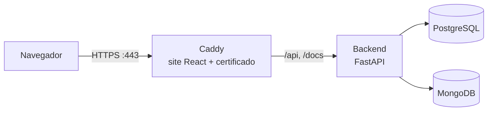

# Deploy na AWS (EC2)

Passo a passo para colocar o OncoPet no ar numa instância **EC2 com Ubuntu**, inclusive numa **t2.micro / t3.micro** (1 GB de RAM), com **HTTPS** e sem precisar comprar domínio.

## Sumário

1. [Como fica no ar](#1-como-fica-no-ar)
2. [Na AWS: preparar a instância](#2-na-aws-preparar-a-instância)
3. [Na instância: instalar e subir](#3-na-instância-instalar-e-subir)
4. [Dados de demonstração](#4-dados-de-demonstração)
5. [Atualizar para uma versão nova](#5-atualizar-para-uma-versão-nova)
6. [Backup e restauração](#6-backup-e-restauração)
7. [Comandos do dia a dia](#7-comandos-do-dia-a-dia)
8. [Problemas comuns](#8-problemas-comuns)
9. [Custos](#9-custos)

---

## 1. Como fica no ar



Tudo roda em **Docker**, numa máquina só (`docker-compose.prod.yml`):

| Serviço | O que faz | Porta aberta na internet |
|---|---|---|
| `web` (Caddy) | Serve o site, gera o certificado HTTPS (Let's Encrypt) e repassa `/api` para o backend | 80 e 443 |
| `backend` | API FastAPI | não (só dentro do Docker) |
| `postgres` | Banco relacional | não |
| `mongodb` | Diário do tutor e exames (com usuário e senha) | não |

**Endereço sem domínio:** o [sslip.io](https://sslip.io) transforma o IP em um nome. O IP `54.12.3.4` vira `54-12-3-4.sslip.io`, e o Caddy consegue um certificado HTTPS de verdade para esse nome.

**Por que HTTPS é obrigatório aqui:** o cookie de sessão é `Secure` em produção, ou seja, o navegador só o envia por HTTPS. Sem HTTPS, o login não se mantém.

### Arquivos do deploy

| Arquivo | Para quê |
|---|---|
| `docker-compose.prod.yml` | Os 4 serviços, volumes e variáveis |
| `backend/Dockerfile` | Imagem da API (Python 3.12) |
| `frontend/Dockerfile` | Gera o site (`npm run build`) e coloca no Caddy |
| `deploy/Caddyfile` | HTTPS, rotas e cabeçalhos de segurança |
| `deploy/preparar-ubuntu.sh` | Cria o swap e instala o Docker |
| `deploy/gerar-env.sh` | Cria o `.env.prod` com o endereço e senhas aleatórias |
| `.env.prod.example` | Modelo do `.env.prod` |

---

## 2. Na AWS: preparar a instância

No console da AWS, em **EC2**:

### 2.1 Liberar as portas (Security Group)

**Instances** → sua instância → aba **Security** → clique no Security Group → **Edit inbound rules**:

| Tipo | Porta | Origem | Para quê |
|---|---|---|---|
| SSH | 22 | **My IP** | Você acessar o terminal |
| HTTP | 80 | `0.0.0.0/0` | Certificado HTTPS e redirecionamento |
| HTTPS | 443 | `0.0.0.0/0` | O site |

A porta 80 precisa ficar aberta: o Let's Encrypt usa ela para confirmar o endereço antes de emitir o certificado.

### 2.2 Fixar o IP (Elastic IP)

O IP público **muda toda vez que a instância é parada e ligada de novo**, e o endereço `sslip.io` depende dele. Para fixar:

**Elastic IPs** → **Allocate Elastic IP address** → **Allocate** → selecione o IP → **Actions → Associate Elastic IP address** → escolha sua instância → **Associate**.

Daqui em diante, use esse IP.

### 2.3 Disco

As imagens Docker ocupam uns 3 GB. Os 8 GB padrão funcionam, mas é mais tranquilo ter **16 a 20 GB**: **Volumes** → volume da instância → **Modify volume**. Depois de aumentar, reinicie a instância (`sudo reboot`): o Ubuntu da AWS expande a partição sozinho ao ligar. Confira com `df -h /`.

---

## 3. Na instância: instalar e subir

### 3.1 Entrar por SSH

No seu computador, na pasta onde está a chave `.pem`:

```bash
chmod 400 minha-chave.pem
ssh -i minha-chave.pem ubuntu@SEU_IP
```

### 3.2 Baixar o projeto

```bash
git clone https://github.com/vivianSantos0101/OncoPet.git
cd OncoPet
git checkout main
```

> Se o repositório for privado, o GitHub vai pedir usuário e senha. No lugar da senha, use um **token**: GitHub → **Settings → Developer settings → Personal access tokens → Fine-grained tokens**, com acesso de leitura (**Contents: Read**) só a esse repositório.

### 3.3 Preparar o Ubuntu (swap + Docker)

```bash
sudo bash deploy/preparar-ubuntu.sh
exit
```

O script cria **2 GB de swap** (memória extra em disco; sem ela, a instância de 1 GB trava no build) e instala o **Docker**. O `exit` é necessário para o seu usuário passar a usar o Docker sem `sudo`. Entre de novo:

```bash
ssh -i minha-chave.pem ubuntu@SEU_IP
cd OncoPet
docker --version && free -h     # tem que aparecer o Docker e "Swap: 2.0Gi"
```

### 3.4 Gerar a configuração

```bash
bash deploy/gerar-env.sh
```

Ele descobre o IP público, monta o endereço `IP-com-tracos.sslip.io` e cria o `.env.prod` com senhas e chave aleatórias. O endereço aparece no final:

```
.env.prod criado.
Endereco do OncoPet: https://54-12-3-4.sslip.io
```

> O `.env.prod` tem as senhas dos bancos e a chave dos logins: **não envie para o GitHub** (ele já está no `.gitignore`) e não apague, porque os bancos foram criados com essas senhas.

### 3.5 Subir

```bash
docker compose -f docker-compose.prod.yml --env-file .env.prod up -d --build
```

Na primeira vez demora uns **10 minutos** na micro: ele baixa as imagens e monta o site. Para acompanhar:

```bash
docker compose -f docker-compose.prod.yml --env-file .env.prod ps
docker compose -f docker-compose.prod.yml --env-file .env.prod logs -f web
```

Quando os 4 serviços estiverem `running` (postgres e mongodb como `healthy`) e o log do `web` mostrar `certificate obtained successfully`, abra o endereço no navegador. 🎉

> Dica: para não digitar tudo isso sempre, crie um atalho:
> ```bash
> echo "alias dc='docker compose -f ~/OncoPet/docker-compose.prod.yml --env-file ~/OncoPet/.env.prod'" >> ~/.bashrc && source ~/.bashrc
> ```
> Daí é só `dc ps`, `dc logs -f backend`, `dc up -d --build`. Os comandos abaixo usam esse atalho.

---

## 4. Dados de demonstração

Para apresentar o sistema já com pacientes, protocolos e diário:

```bash
dc exec backend python scripts/seed_demo.py --api http://localhost:8000
```

Logins: `dra_ana`, `dr_marcos` (veterinários) e `joao`, `mariana`, `carla`, `pedro`, `rafael` (tutores), todos com a senha `oncopet123`.

> Se o sistema for usado de verdade (não só para a apresentação), **não rode o seed**: essas senhas são públicas.

---

## 5. Atualizar para uma versão nova

Depois de um merge na `main`:

```bash
cd ~/OncoPet
git pull
dc up -d --build
```

Os dados ficam nos volumes do Docker e **não se perdem** na atualização. Para liberar espaço das imagens antigas: `docker image prune -f`.

---

## 6. Backup e restauração

### Fazer backup

```bash
mkdir -p ~/backups && cd ~/backups
DATA=$(date +%F)
dc exec -T postgres pg_dump -U oncopet oncopet | gzip > postgres-$DATA.sql.gz
dc exec -T mongodb sh -c 'mongodump --username oncopet --password "$MONGO_INITDB_ROOT_PASSWORD" --authenticationDatabase admin --archive --gzip' > mongo-$DATA.archive.gz
dc cp backend:/app/app/uploads ./uploads-$DATA
ls -lh
```

Para trazer para o seu computador:

```bash
scp -i minha-chave.pem -r ubuntu@SEU_IP:~/backups ./backups-oncopet
```

### Restaurar

```bash
gunzip -c postgres-AAAA-MM-DD.sql.gz | dc exec -T postgres psql -U oncopet oncopet
dc exec -T mongodb sh -c 'mongorestore --username oncopet --password "$MONGO_INITDB_ROOT_PASSWORD" --authenticationDatabase admin --archive --gzip --drop' < mongo-AAAA-MM-DD.archive.gz
```

---

## 7. Comandos do dia a dia

| Para | Comando |
|---|---|
| Ver se está tudo rodando | `dc ps` |
| Ver os logs da API | `dc logs -f backend` |
| Ver os logs do Caddy (HTTPS) | `dc logs -f web` |
| Reiniciar só a API | `dc restart backend` |
| Parar tudo | `dc down` (os dados continuam nos volumes) |
| Subir de novo | `dc up -d` |
| Memória e swap | `free -h` |
| Uso de CPU e memória por serviço | `docker stats --no-stream` |
| Espaço em disco | `df -h /` |

> ⚠️ `dc down -v` **apaga os volumes**, ou seja, todos os dados. Só use se quiser começar do zero.

---

## 8. Problemas comuns

| Sintoma | Causa provável | Solução |
|---|---|---|
| O site não abre | Portas 80/443 fechadas | Confira o Security Group (item 2.1) |
| Erro de certificado / `web` reclamando do ACME | Porta 80 fechada, ou o IP do `.env.prod` não é o da instância | Abra a porta 80. Confira `curl -s https://checkip.amazonaws.com` × `DOMAIN` no `.env.prod`; se mudou, corrija o `DOMAIN` e rode `dc up -d web` |
| Mudou o IP (parou e ligou a instância sem Elastic IP) | O `sslip.io` usa o IP antigo | Associe um Elastic IP (2.2), atualize o `DOMAIN` no `.env.prod` e rode `dc up -d web` |
| O build para no meio ("Killed") | Faltou memória | Confira o swap com `free -h`; se não aparecer, rode de novo o `deploy/preparar-ubuntu.sh` |
| Página abre, mas dá erro ao entrar / `502` | A API ainda está iniciando ou caiu | `dc logs backend`; espere o postgres e o mongodb ficarem `healthy` |
| Faz login, mas volta para a tela de login | Acessando por `http://` ou pelo IP puro | Use sempre o endereço `https://...sslip.io` (o cookie é `Secure`) |
| `permission denied` ao usar `docker` | O usuário ainda não está no grupo docker | Saia e entre de novo no SSH |
| Disco cheio | Imagens antigas acumuladas | `docker image prune -f` e `docker builder prune -f` |

---

## 9. Custos

- A **t2.micro / t3.micro** e até **30 GB de disco** entram no nível gratuito da AWS (para contas elegíveis, dentro dos limites de horas por mês).
- A AWS cobra por **endereço IPv4 público**, inclusive Elastic IP. Contas no nível gratuito têm uma franquia de horas; confira em **Billing → Free Tier**.
- O **sslip.io** e o certificado do **Let's Encrypt** são gratuitos.
- Quando não for usar por um tempo, pare a instância (**Instance state → Stop**). Com Elastic IP, o endereço continua o mesmo quando ligar de novo. Elastic IP parado sem instância associada costuma ser cobrado: se não for mais usar, libere (**Release**).
