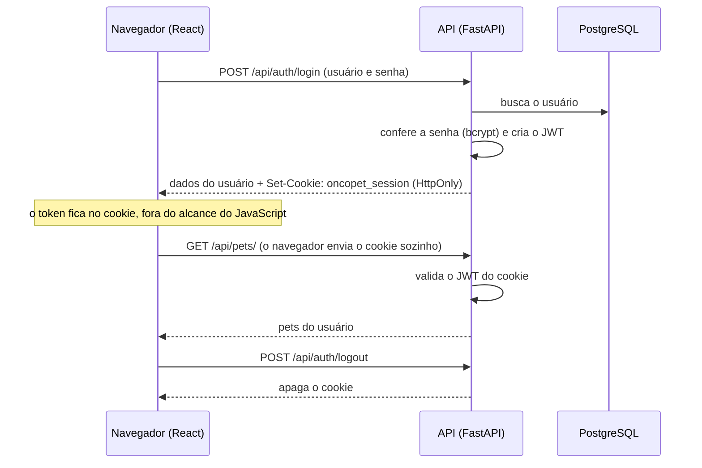

# Manual de autenticação

Como o OncoPet sabe quem está usando o sistema, onde a sessão fica guardada e o que cada pessoa pode acessar.

## Sumário

1. [Resumo](#1-resumo)
2. [Onde fica o código](#2-onde-fica-o-código)
3. [O fluxo, passo a passo](#3-o-fluxo-passo-a-passo)
4. [Por que cookie HttpOnly e não localStorage](#4-por-que-cookie-httponly-e-não-localstorage)
5. [Proteção contra CSRF](#5-proteção-contra-csrf)
6. [Permissões](#6-permissões)
7. [Rotas](#7-rotas)
8. [Configuração](#8-configuração)
9. [Testes](#9-testes)
10. [Limites conhecidos](#10-limites-conhecidos)

---

## 1. Resumo

| Item | Como é no OncoPet |
|---|---|
| Senha | Guardada só como hash **bcrypt** (nunca em texto) |
| Sessão | Token **JWT** assinado com **HS256**, válido por **8 horas** |
| Onde o token fica | Num cookie **`HttpOnly`** chamado `oncopet_session`, criado pelo backend |
| O que fica no navegador | **Nada** no `localStorage`; o JavaScript não tem acesso ao token |
| Proteção contra CSRF | Cookie `SameSite=Lax` + cabeçalho `X-Requested-With` obrigatório para alterações |
| Papéis | `vet` (veterinário) e `tutor` |
| Acesso aos dados | Cada um só vê os próprios pets: tutor dono e vet responsável |

---

## 2. Onde fica o código

| Arquivo | Papel |
|---|---|
| `backend/app/auth.py` | Hash de senha, criação e leitura do token, cookie, anti-CSRF, `get_current_user`, `require_vet` |
| `backend/app/routers/auth.py` | Rotas `register`, `login`, `me` e `logout` |
| `backend/app/routers/pets.py` | `ensure_pet_access`: regra de quem pode ver cada pet |
| `backend/app/config.py` | Chave secreta, validade e opções do cookie |
| `frontend/src/api.js` | Cliente HTTP: envia o cookie e o cabeçalho anti-CSRF; avisa quando a sessão expira |
| `frontend/src/App.jsx` | Ao abrir, pergunta à API quem está logado (`/auth/me`) |

---

## 3. O fluxo, passo a passo

1. **Login:** o front envia usuário e senha. O backend confere a senha com o hash e cria um JWT com o nome do usuário (`sub`) e a validade (`exp`).
2. **Cookie:** o backend responde com `Set-Cookie`. O navegador guarda o cookie e passa a enviá-lo em toda chamada para `/api`.
3. **Abrir o app ou dar F5:** o `App.jsx` chama `GET /api/auth/me`. Se o cookie for válido, a API devolve o usuário e a tela abre logada; senão, aparece o login.
4. **Sessão expirou no meio do uso:** a API responde `401`, o `api.js` dispara um evento e o `App.jsx` volta para o login.
5. **Sair:** `POST /api/auth/logout` apaga o cookie.

---

## 4. Por que cookie HttpOnly e não localStorage

Antes, o token ficava no `localStorage`. Qualquer JavaScript rodando na página conseguia ler dali, inclusive um script malicioso injetado por uma falha de XSS, e o token poderia ser roubado e usado em outro lugar.

Com o cookie `HttpOnly`:

- o **JavaScript não consegue ler** o cookie (`document.cookie` não mostra ele);
- o **navegador envia sozinho** em cada requisição para `/api`, então o front não precisa guardar nem montar nada;
- o `Path=/api` faz o cookie ir só para a API, não para as páginas e imagens.

Ao abrir a nova versão, o `App.jsx` também apaga as chaves `oncopet_token` e `oncopet_user` que versões anteriores deixavam no `localStorage`.

---

## 5. Proteção contra CSRF

Cookie tem um risco próprio: como o navegador envia sozinho, um site malicioso poderia tentar fazer o navegador da vítima mandar uma requisição para o OncoPet (CSRF). Duas camadas impedem isso:

| Camada | Como protege |
|---|---|
| `SameSite=Lax` | O navegador não envia o cookie em `POST`, `PATCH` ou `DELETE` vindos de outro site |
| Cabeçalho `X-Requested-With: XMLHttpRequest` | O front do OncoPet envia em toda requisição. Para alterações feitas com o cookie, o backend **exige** esse cabeçalho e responde `403` sem ele. Um formulário de outro site não consegue adicionar cabeçalhos, e o CORS bloqueia `fetch` de outras origens com cabeçalhos extras |

Leituras (`GET`) não alteram nada e não precisam do cabeçalho.

---

## 6. Permissões

| Regra | Onde |
|---|---|
| Só veterinário | `require_vet` (cadastrar sessão, protocolo, documento, exame, lembrete; painel paliativo) |
| Só tutor | `require_tutor` (registrar no diário) |
| Só o dono do pet ou o vet responsável | `ensure_pet_access` em todas as rotas com `pet_id` |

Sem login: `401`. Logado, mas sem acesso àquele pet ou recurso: `403`.

---

## 7. Rotas

| Rota | Faz |
|---|---|
| `POST /api/auth/register` | Cria a conta e já entra (grava o cookie) |
| `POST /api/auth/login` | Entra (grava o cookie). Formulário com `username` e `password` |
| `GET /api/auth/me` | Devolve o usuário da sessão atual |
| `POST /api/auth/logout` | Sai (apaga o cookie) |

O login também devolve `access_token` no corpo da resposta. Ele serve para clientes que não são o navegador e usam o cabeçalho `Authorization: Bearer`: o botão **Authorize** do `/docs`, os testes automáticos, o `scripts/seed_demo.py` e o `curl`. O front do OncoPet não usa nem guarda esse valor.

---

## 8. Configuração

Variáveis de ambiente (ver `.env.example`):

| Variável | Padrão | Para quê |
|---|---|---|
| `SECRET_KEY` | chave de desenvolvimento | Assina os tokens. **Em produção, troque por uma chave aleatória** |
| `ACCESS_TOKEN_EXPIRE_MINUTES` | `480` | Validade da sessão (8 horas) |
| `COOKIE_SECURE` | `false` | `true` em produção com HTTPS: o cookie só trafega criptografado |
| `COOKIE_SAMESITE` | `lax` | Política `SameSite` do cookie |

Em desenvolvimento, o Vite repassa `/api` para o backend (proxy em `vite.config.js`), então front e API ficam na mesma origem e o cookie funciona sem configuração extra.

---

## 9. Testes

`backend/tests/test_auth_cookie.py` (7 testes):

| Teste | O que confere |
|---|---|
| `test_login_grava_cookie_httponly` | Cookie com `HttpOnly`, `SameSite=Lax`, `Path=/api` e validade de 8 horas |
| `test_me_funciona_so_com_o_cookie` | `/me` responde usando apenas o cookie |
| `test_sem_sessao_da_401` | Sem cookie ou com cookie falso: `401` |
| `test_logout_apaga_o_cookie` | Depois do logout, `/me` dá `401` |
| `test_cadastro_ja_entra_logado` | O cadastro já grava o cookie |
| `test_csrf_alteracao_com_cookie_exige_cabecalho` | `POST` só com cookie dá `403`; com o cabeçalho funciona |
| `test_cabecalho_authorization_continua_valendo` | `/docs`, scripts e curl continuam funcionando com `Bearer` |

As regras por pet estão em `test_access_control.py` e `test_pet_permissions.py`.

---

## 10. Limites conhecidos

| Ponto | Situação |
|---|---|
| Cadastro aberto | Quem se cadastra escolhe se é `vet` ou `tutor`. Num sistema real, o cadastro de veterinário passaria por aprovação ou convite |
| Sem renovação automática | Depois de 8 horas é preciso entrar de novo |
| Logout não invalida o token no servidor | O cookie é apagado no navegador, mas um token copiado antes continuaria válido até expirar. Resolver exigiria uma lista de tokens revogados |
| Arquivos enviados | `/api/uploads/files/...` abre sem login (as imagens aparecem em ``); o nome do arquivo é aleatório (UUID) |
