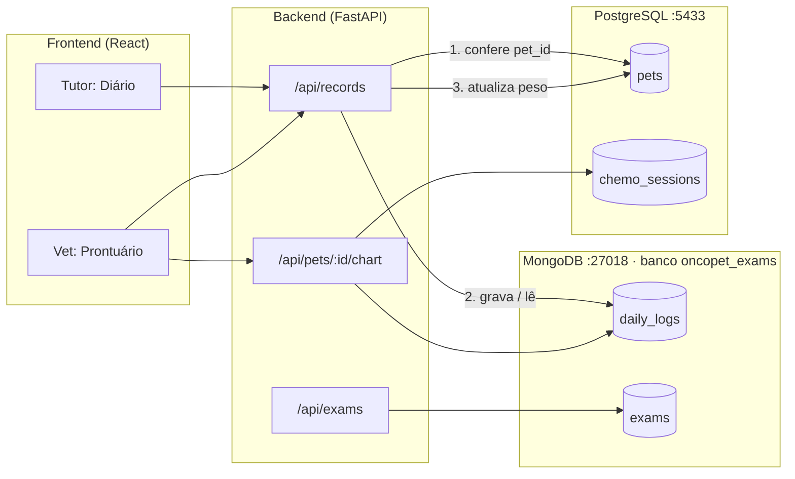
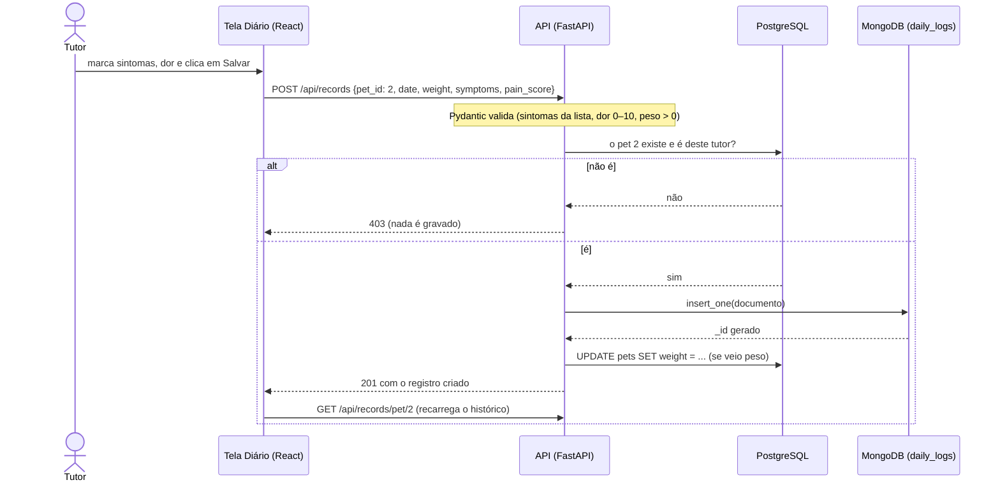

# Manual do MongoDB no OncoPet

Este manual explica tudo o que o OncoPet faz com o MongoDB: por que ele existe no projeto, onde ele roda, como ver e consultar os dados, como o código funciona (arquivo por arquivo e função por função), como testar e o que fazer quando algo dá errado.

> Os comandos deste manual foram testados com os dados de demonstração (`scripts/seed_demo.py`). Nos exemplos, a Luna é o pet de `id` 2 e a tutora dela é a `mariana` (senha `oncopet123`).

## Sumário

1. [Visão geral: por que dois bancos](#1-visão-geral-por-que-dois-bancos)
2. [Onde o MongoDB roda](#2-onde-o-mongodb-roda)
3. [Como subir, parar e zerar](#3-como-subir-parar-e-zerar)
4. [Como ver os dados](#4-como-ver-os-dados)
5. [Coleções e formato dos documentos](#5-coleções-e-formato-dos-documentos)
6. [Índices](#6-índices)
7. [O código, arquivo por arquivo](#7-o-código-arquivo-por-arquivo)
8. [O caminho de um registro, do clique ao banco](#8-o-caminho-de-um-registro-do-clique-ao-banco)
9. [Integridade entre os dois bancos (RNF-03)](#9-integridade-entre-os-dois-bancos-rnf-03)
10. [Endpoints da API que usam o MongoDB](#10-endpoints-da-api-que-usam-o-mongodb)
11. [Telas do frontend que usam esses dados](#11-telas-do-frontend-que-usam-esses-dados)
12. [Scripts: dados de demonstração e migração](#12-scripts-dados-de-demonstração-e-migração)
13. [Testes](#13-testes)
14. [Backup e restauração](#14-backup-e-restauração)
15. [Problemas comuns](#15-problemas-comuns)
16. [Glossário](#16-glossário)

---

## 1. Visão geral: por que dois bancos

A especificação técnica do OncoPet pede dois bancos com papéis diferentes:

| Banco | Tipo | O que guarda no OncoPet | Por quê |
|---|---|---|---|
| **PostgreSQL** | Relacional (tabelas) | Usuários, clínicas, pacientes (pets), protocolos de quimioterapia, sessões, documentos, lembretes | São dados centrais, com relações fixas entre si (um pet tem um tutor, uma sessão pertence a um protocolo). Tabelas e chaves estrangeiras garantem essas relações. |
| **MongoDB** | Documentos (NoSQL) | **Diário do tutor** (peso, sintomas, escala de dor) e **exames** | É histórico que cresce todo dia e cujo formato pode variar (um registro tem 3 sintomas, outro nenhum; um hemograma tem campos diferentes de um raio-X). Documentos flexíveis e consultas por data são o ponto forte do MongoDB. |

> A especificação cita MySQL como banco principal. O projeto hoje usa PostgreSQL (veja `docs/ANALISE_REQUISITOS.md`). Para o MongoDB isso não muda nada: o papel dele é o mesmo com qualquer banco relacional.

O elo entre os dois bancos é o **`pet_id`**: todo documento do MongoDB guarda o `id` do pet na tabela `pets` do PostgreSQL.



---

## 2. Onde o MongoDB roda

O MongoDB roda num **container Docker**, definido no `docker-compose.yml` da raiz do projeto:

```yaml
mongodb:
  image: mongo:7
  container_name: oncopet-mongo
  ports:
    - "27018:27017"
  volumes:
    - mongo_data:/data/db
  restart: unless-stopped
```

O que cada linha significa:

| Linha | Significado |
|---|---|
| `image: mongo:7` | Usa a imagem oficial do MongoDB, versão 7. |
| `container_name: oncopet-mongo` | Nome do container. É o nome usado nos comandos `docker exec`. |
| `ports: "27018:27017"` | Dentro do container o MongoDB escuta na porta padrão **27017**. No seu computador ela aparece como **27018**, para não conflitar com um MongoDB que você já tenha instalado. |
| `volumes: mongo_data:/data/db` | Os dados ficam num **volume Docker** chamado `oncopet_mongo_data`. Desligar o container **não apaga** os dados; só `docker compose down -v` apaga. |
| `restart: unless-stopped` | O container volta sozinho quando o Docker reinicia, a menos que você o pare manualmente. |

### Configuração no backend

O backend descobre onde está o MongoDB por duas variáveis de ambiente (arquivo `backend/app/config.py`):

| Variável | Valor padrão | Para que serve |
|---|---|---|
| `MONGODB_URL` | `mongodb://localhost:27018` | Endereço do servidor. |
| `MONGODB_DB_NAME` | `oncopet_exams` | Nome do **banco** dentro do servidor. |

Se precisar mudar, copie `.env.example` para `.env` e exporte as variáveis antes de subir o backend.

> **Sobre o nome `oncopet_exams`:** quando o MongoDB entrou no projeto ele guardava só exames. Hoje guarda também o diário, mas o nome ficou. Renomear é simples (trocar `MONGODB_DB_NAME`), mas quem já tem dados precisaria copiá-los para o banco novo.

### Bibliotecas usadas

| Pacote | Versão | Papel |
|---|---|---|
| `motor` | 3.7.1 | Driver **assíncrono** do MongoDB para Python. É o que a API usa. |
| `pymongo` | 4.10.1 | Driver síncrono (base do Motor). Usado pelo script de migração. |
| `mongomock-motor` | 0.0.36 | MongoDB **em memória**, só para os testes (em `requirements-dev.txt`). |

---

## 3. Como subir, parar e zerar

Todos os comandos são rodados na **raiz do projeto** (a pasta que tem o `docker-compose.yml`).

| Quero... | Comando |
|---|---|
| Subir Postgres e MongoDB | `docker compose up -d` |
| Ver se estão rodando | `docker compose ps` (os dois devem estar **Up**) |
| Ver o log do MongoDB | `docker logs oncopet-mongo --tail 50` |
| Parar sem perder dados | `docker compose down` |
| **Zerar tudo** (apaga os dados dos dois bancos) | `docker compose down -v && docker compose up -d` |

### Ordem certa para rodar o sistema

```bash
# 1. bancos
docker compose up -d

# 2. backend (em outro terminal)
cd backend
source .venv/bin/activate
uvicorn app.main:app --reload

# 3. (opcional) dados de demonstração
python scripts/seed_demo.py
```

Quando o backend conecta, aparece no terminal:

```
MongoDB conectado: oncopet_exams
Application startup complete.
```

> **Importante:** o backend **não sobe** se o MongoDB estiver desligado. Na inicialização ele cria os índices e, se não achar o servidor, espera o tempo limite de conexão (30 segundos por padrão) e para com `ServerSelectionTimeoutError` e `Application startup failed`. A solução é subir o Docker antes (veja [Problemas comuns](#15-problemas-comuns)).

---

## 4. Como ver os dados

Há três jeitos: pelo terminal (`mongosh`), por um programa visual (MongoDB Compass) ou pela própria API.

### 4.1 Pelo terminal com `mongosh`

O `mongosh` é o terminal oficial do MongoDB e já vem dentro do container. Não precisa instalar nada.

**Abrir o terminal do MongoDB no banco do OncoPet:**

```bash
docker exec -it oncopet-mongo mongosh oncopet_exams
```

O prompt muda para `oncopet_exams>`. A partir daí, os comandos são digitados dentro do `mongosh`:

| Comando | O que faz |
|---|---|
| `show dbs` | Lista os bancos do servidor. |
| `show collections` | Lista as coleções do banco atual (`daily_logs`, `exams`). |
| `db.daily_logs.countDocuments()` | Conta todos os registros do diário. |
| `db.daily_logs.find().limit(3)` | Mostra 3 registros quaisquer. |
| `db.daily_logs.getIndexes()` | Mostra os índices da coleção. |
| `exit` | Sai do `mongosh`. |

**Consultas úteis** (todas testadas com os dados de demonstração):

```javascript
// Últimos 5 registros da Luna (pet_id 2), do mais recente para o mais antigo,
// mostrando só alguns campos (1 = mostrar, 0 = esconder)
db.daily_logs.find(
  { pet_id: 2 },
  { _id: 0, date: 1, weight: 1, symptoms: 1, other_symptoms: 1, pain_score: 1 }
).sort({ date: -1 }).limit(5)

// Quantos registros a Luna tem
db.daily_logs.countDocuments({ pet_id: 2 })

// Registros com vômito (em qualquer pet)
// Como "symptoms" é uma lista, o MongoDB procura o valor dentro dela
db.daily_logs.find({ symptoms: "vomito" })

// Registros com dor intensa (7 ou mais)
db.daily_logs.find({ pain_score: { $gte: 7 } })

// Registros da Luna em setembro de 2026
// As datas são texto 'AAAA-MM-DD', então a comparação de texto funciona
db.daily_logs.find({ pet_id: 2, date: { $gte: "2026-09-01", $lte: "2026-09-30" } })

// Média de dor da Luna (ignora registros sem dor avaliada)
db.daily_logs.aggregate([
  { $match: { pet_id: 2, pain_score: { $ne: null } } },
  { $group: { _id: "$pet_id", media_dor: { $avg: "$pain_score" }, registros: { $sum: 1 } } }
])

// Sintomas mais frequentes em todos os pets
db.daily_logs.aggregate([
  { $unwind: "$symptoms" },
  { $group: { _id: "$symptoms", vezes: { $sum: 1 } } },
  { $sort: { vezes: -1 } }
])
```

**Rodar uma consulta sem entrar no `mongosh`** (útil para scripts ou para copiar e colar):

```bash
docker exec -it oncopet-mongo mongosh oncopet_exams --quiet --eval \
  'db.daily_logs.find({pet_id: 2}, {_id:0, date:1, symptoms:1, pain_score:1}).sort({date:-1}).limit(3)'
```

### 4.2 Pelo MongoDB Compass (visual)

1. Baixe e instale o **MongoDB Compass** (gratuito, site oficial do MongoDB).
2. Em **New connection**, use: `mongodb://localhost:27018`
3. Clique em **Connect**, abra o banco **`oncopet_exams`** e a coleção **`daily_logs`**.
4. No campo **Filter**, você pode digitar filtros como `{ pet_id: 2 }` ou `{ pain_score: { $gte: 7 } }`.

No Compass também dá para ver os índices (aba **Indexes**) e montar agregações visualmente (aba **Aggregations**).

### 4.3 Pela API

Com o backend rodando, abra **http://localhost:8000/docs**. É a documentação interativa gerada pelo FastAPI:

1. Clique em **Authorize** e faça login (por exemplo, `mariana` / `oncopet123`).
2. Abra `GET /api/records/pet/{pet_id}`, clique em **Try it out**, informe `2` e **Execute**.

Os exemplos com `curl` estão na [seção 10](#10-endpoints-da-api-que-usam-o-mongodb).

### 4.4 E o peso? (fica também no PostgreSQL)

Quando o tutor informa o peso no diário, ele é gravado no documento do MongoDB **e** atualiza o campo `weight` do pet no PostgreSQL (esse é o peso usado no cálculo de dose). Para conferir:

```bash
docker exec -it oncopet-postgres psql -U oncopet -d oncopet -c "SELECT id, name, weight FROM pets;"
```

---

## 5. Coleções e formato dos documentos

No MongoDB, os dados ficam em **coleções** (parecido com tabelas), e cada item é um **documento** (parecido com um JSON). Documentos da mesma coleção podem ter campos diferentes.

O OncoPet usa duas coleções no banco `oncopet_exams`:

| Coleção | Conteúdo | Quem grava |
|---|---|---|
| `daily_logs` | Diário do tutor: peso, sintomas, escala de dor | Tutor, pela tela **Diário** |
| `exams` | Resultados de exames com campos variáveis | Veterinário, pela API `/api/exams` |

### 5.1 `daily_logs` (diário do tutor)

Exemplo de documento (formato exato gravado pelo sistema):

```json
{
  "_id": ObjectId("6abaac1e8146b4092d7a1d64"),
  "pet_id": 2,
  "date": "2026-09-22",
  "weight": 28.3,
  "symptoms": ["letargia", "inapetencia"],
  "other_symptoms": "Mancando da pata traseira",
  "pain_score": 5,
  "general_status": "bom",
  "appetite": "normal",
  "energy_level": "normal",
  "photo_url": null,
  "notes": "Brincou normalmente.",
  "created_by": 4,
  "created_at": "2026-09-28T18:03:44.229916+00:00"
}
```

| Campo | Tipo | Obrigatório | Regra / significado |
|---|---|---|---|
| `_id` | ObjectId | automático | Identificador único criado pelo MongoDB. Na API ele vira o campo `id` (texto de 24 caracteres). |
| `pet_id` | número | sim | `id` do pet na tabela `pets` do PostgreSQL. É o elo entre os bancos. |
| `date` | texto `AAAA-MM-DD` | sim | Dia do registro. É guardado como texto porque nesse formato a ordem alfabética é a ordem cronológica, o que permite ordenar e filtrar por período. |
| `weight` | número | não | Peso em kg, maior que 0 e até 150. |
| `symptoms` | lista de textos | não (padrão `[]`) | Sintomas marcados. Só aceita: `vomito`, `diarreia`, `letargia`, `inapetencia`, `febre`, `tosse`, `dispneia`, `lesao_pele`. |
| `other_symptoms` | texto | não | Sintomas fora da lista, em texto livre. |
| `pain_score` | número inteiro | não | Escala de dor de **0 a 10**. `null` significa "não avaliada". |
| `general_status` | texto | não | Estado geral (`otimo`, `bom`, `regular`, `ruim`). |
| `appetite` | texto | não | Apetite (`normal`, `reduzido`, `ausente`). |
| `energy_level` | texto | não | Energia (`alto`, `normal`, `baixo`, `letargico`). |
| `photo_url` | texto | não | Foto anexada (reservado para uso futuro). |
| `notes` | texto | não | Observações livres. |
| `created_by` | número | automático | `id` do usuário (tutor) que registrou. |
| `created_at` | texto ISO | automático | Data e hora da gravação, em UTC. |
| `migrated_from_sql_id` | número | só em migrados | Aparece apenas em registros copiados do banco antigo (veja [seção 12.2](#122-migração-do-diário-antigo)). |

**Faixas da escala de dor** (usadas nas cores da tela):

| Nota | Faixa | Cor na tela |
|---|---|---|
| 0 | Sem dor | verde-menta |
| 1 a 3 | Dor leve | verde |
| 4 a 6 | Dor moderada | laranja |
| 7 a 10 | Dor intensa | vermelho |

**Nomes dos sintomas na tela:**

| Valor gravado | Aparece como |
|---|---|
| `vomito` | Vômito |
| `diarreia` | Diarreia |
| `letargia` | Letargia |
| `inapetencia` | Falta de apetite |
| `febre` | Febre |
| `tosse` | Tosse |
| `dispneia` | Falta de ar |
| `lesao_pele` | Lesão de pele |

### 5.2 `exams` (exames)

Cada exame tem campos fixos e um campo `data` livre, cujo conteúdo muda conforme o tipo de exame. É um bom exemplo do porquê de usar MongoDB: um hemograma e um laudo de imagem não precisam de colunas iguais.

```json
{
  "_id": ObjectId("..."),
  "pet_id": 1,
  "exam_type": "hemograma",
  "date": "2026-09-14",
  "lab_name": "Laboratório Exemplo",
  "file_url": null,
  "notes": null,
  "data": { "leucocitos": 5200, "hemoglobina": 13.1, "plaquetas": 210000 },
  "uploaded_by": 1,
  "created_at": "2026-09-14T13:00:00"
}
```

> As telas atuais ainda não mostram a coleção `exams` (os laudos em PDF ficam na tabela `documents` do PostgreSQL). Ela está disponível pela API.

---

## 6. Índices

Um **índice** funciona como o índice de um livro: em vez de ler a coleção inteira, o MongoDB vai direto aos documentos certos.

| Coleção | Índice | Nome no MongoDB | Para que serve |
|---|---|---|---|
| `daily_logs` | `{ pet_id: 1, date: -1 }` | `pet_id_1_date_-1` | A consulta mais comum do sistema: "registros de um pet, do mais recente para o mais antigo". O `1` é crescente e o `-1` é decrescente. |
| `exams` | `{ pet_id: 1 }` | `pet_id_1` | Buscar exames de um pet. |
| `exams` | `{ exam_type: 1 }` | `exam_type_1` | Filtrar por tipo de exame. |

Os índices são criados **automaticamente** quando o backend sobe (função `create_indexes`). Criar um índice que já existe não faz nada, então isso é seguro a cada inicialização.

Para conferir:

```bash
docker exec -it oncopet-mongo mongosh oncopet_exams --quiet --eval 'db.daily_logs.getIndexes()'
```

---

## 7. O código, arquivo por arquivo

Todos os caminhos são a partir de `backend/`.

### 7.1 `app/mongodb.py`: conexão

Guarda a conexão com o MongoDB numa variável global `db`, que as rotas usam.

| Função | O que faz |
|---|---|
| `create_indexes(database)` | Cria os índices das coleções `exams` e `daily_logs` (veja a [seção 6](#6-índices)). É `async` porque o Motor é assíncrono. |
| `connect_mongodb()` | Cria o cliente (`AsyncIOMotorClient`) com `MONGODB_URL`, escolhe o banco `MONGODB_DB_NAME`, chama `create_indexes` e imprime `MongoDB conectado: ...`. |
| `close_mongodb()` | Fecha a conexão quando o backend desliga. |
| `get_daily_logs_collection()` | Devolve a coleção `daily_logs`. As rotas pedem a coleção por essa função em vez de acessar `db` direto, o que facilita trocar o banco nos testes. |
| `get_exams_collection()` | Mesma ideia, para a coleção `exams`. |

### 7.2 `app/main.py`: quando a conexão abre e fecha

O FastAPI tem um **lifespan**, um bloco que roda uma vez quando a aplicação liga e outra quando desliga:

```python
@asynccontextmanager
async def lifespan(app: FastAPI):
    await connect_mongodb()   # ao ligar
    yield                     # a API atende requisições aqui
    await close_mongodb()     # ao desligar
```

É por isso que o backend não sobe sem o MongoDB: a criação dos índices, dentro de `connect_mongodb`, precisa falar com o servidor.

### 7.3 `app/schemas.py`: o formato aceito e devolvido

Os schemas (Pydantic) definem e **validam** o que entra e sai da API. Se algo estiver fora da regra, a API responde **422** antes de tocar no banco.

| Schema | Papel |
|---|---|
| `Symptom` | A lista fechada de sintomas aceitos (`vomito`, `diarreia`, `letargia`, `inapetencia`, `febre`, `tosse`, `dispneia`, `lesao_pele`). |
| `RecordCreate` | O que o tutor envia ao criar um registro. Valida: `weight` maior que 0 e até 150; `symptoms` só da lista; `pain_score` entre 0 e 10; `date` como data válida. |
| `RecordResponse` | O que a API devolve. O `_id` do MongoDB vira `id` (texto). |

### 7.4 `app/services/daily_logs.py`: regras do diário

As regras ficam num **serviço** separado das rotas (exigência de organização da especificação, RNF-04). Assim as rotas só recebem a requisição, chamam o serviço e respondem.

| Função | O que faz |
|---|---|
| `to_document(data, created_by)` | Converte o `RecordCreate` num documento pronto para o MongoDB: transforma a data em texto `AAAA-MM-DD` e acrescenta `created_by` e `created_at`. |
| `to_response(doc)` | Faz o caminho inverso: documento do MongoDB → `RecordResponse` (converte `_id` em `id` e o texto da data em data). |
| `list_logs(collection, pet_id, newest_first=True, limit=None)` | Busca os registros de um pet ordenados por data (mais recente primeiro por padrão, ou o contrário com `newest_first=False`). Usa o índice `pet_id_1_date_-1`. |

### 7.5 `app/routers/records.py`: rotas do diário

| Rota | Função | Passo a passo |
|---|---|---|
| `POST /api/records/` | `create_record` | 1) Só **tutor** pode chamar. 2) Confere no **PostgreSQL** se o pet existe e é desse tutor; se não, responde **403** e **nada é gravado no MongoDB**. 3) Monta o documento (`to_document`) e grava com `insert_one`. 4) Se veio peso, atualiza `pets.weight` no PostgreSQL. 5) Devolve o registro criado. |
| `GET /api/records/pet/{pet_id}` | `list_records` | 1) Confere no PostgreSQL se o pet existe (**404** se não). 2) Se quem pede é tutor, ele precisa ser o dono (**403** se não); veterinário pode ver. 3) Busca no MongoDB com `list_logs` e devolve do mais recente para o mais antigo. |

### 7.6 `app/routers/pets.py`: gráfico de peso

`GET /api/pets/{pet_id}/chart` monta o gráfico de peso do prontuário juntando os **dois bancos**:

- pesos das **sessões de quimioterapia** (tabela `chemo_sessions`, no PostgreSQL);
- pesos do **diário do tutor** (coleção `daily_logs`, no MongoDB, via `list_logs` em ordem crescente).

Os pontos são ordenados por data e devolvidos junto com totais (`sessions_count`, `records_count`), o último peso e os dias de tratamento.

### 7.7 `app/routers/exams.py`: exames

| Rota | Quem pode | O que faz |
|---|---|---|
| `POST /api/exams/` | Veterinário | Grava um exame (`insert_one`). |
| `GET /api/exams/pet/{pet_id}` | Qualquer usuário logado | Lista exames do pet, mais recentes primeiro. Aceita `?exam_type=hemograma` para filtrar. |
| `GET /api/exams/{exam_id}` | Qualquer usuário logado | Busca um exame pelo `_id`. |
| `DELETE /api/exams/{exam_id}` | Veterinário | Apaga um exame. |

---

## 8. O caminho de um registro, do clique ao banco

O que acontece quando a tutora da Luna marca "Letargia", escolhe dor 6 e clica em **Salvar Registro**:



---

## 9. Integridade entre os dois bancos (RNF-03)

Bancos diferentes não têm chave estrangeira entre si: o MongoDB não sabe que existe uma tabela `pets`. A integridade é garantida **pela API**:

| Garantia | Como |
|---|---|
| Não existe registro do diário para pet inexistente | `create_record` consulta o PostgreSQL antes do `insert_one`. Pet inexistente → 403, nada é gravado. |
| Tutor só grava e vê o próprio pet | A mesma consulta confere `pets.tutor_id`. |
| O peso fica igual nos dois lugares | O peso do diário atualiza `pets.weight` na mesma requisição. |

**Limites atuais** (bom saber):

- Se um pet for apagado do PostgreSQL, os documentos dele continuam no MongoDB (hoje o sistema não tem rota para apagar pets).
- A coleção `exams` ainda **não** confere se o `pet_id` existe antes de gravar.
- Se o MongoDB gravar e a atualização do peso no PostgreSQL falhar, o registro fica salvo sem o peso atualizado no cadastro. Os dois bancos não participam de uma mesma transação.

---

## 10. Endpoints da API que usam o MongoDB

| Método e rota | Quem pode | Respostas |
|---|---|---|
| `POST /api/records/` | Tutor dono do pet | 201 criado · 403 pet não é seu ou não existe · 422 dados inválidos |
| `GET /api/records/pet/{pet_id}` | Tutor dono ou veterinário | 200 lista · 403 pet de outro tutor · 404 pet não existe |
| `GET /api/pets/{pet_id}/chart` | Usuário logado | 200 dados do gráfico · 404 pet não existe |
| `POST /api/exams/` | Veterinário | 201 criado |
| `GET /api/exams/pet/{pet_id}` | Usuário logado | 200 lista |
| `GET /api/exams/{exam_id}` | Usuário logado | 200 · 400 id inválido · 404 não encontrado |
| `DELETE /api/exams/{exam_id}` | Veterinário | 204 apagado · 400 · 404 |

### Exemplos com `curl`

```bash
# 1. Login (guarda o token numa variável)
TOKEN=$(curl -s -X POST localhost:8000/api/auth/login \
  -d "username=mariana&password=oncopet123" \
  | python3 -c "import sys,json;print(json.load(sys.stdin)['access_token'])")

# 2. Criar um registro no diário da Luna
curl -s -X POST localhost:8000/api/records/ \
  -H "Authorization: Bearer $TOKEN" -H "Content-Type: application/json" \
  -d '{"pet_id": 2, "date": "2026-09-28", "weight": 28.1,
       "symptoms": ["vomito", "letargia"], "pain_score": 4,
       "notes": "Teste pelo terminal"}'

# 3. Listar o diário da Luna
curl -s localhost:8000/api/records/pet/2 -H "Authorization: Bearer $TOKEN"
```

Resposta do passo 2:

```json
{"id":"6abaac1e8146b4092d7a1d64","pet_id":2,"date":"2026-09-28","weight":28.1,
 "symptoms":["vomito","letargia"],"other_symptoms":null,"pain_score":4,
 "general_status":null,"appetite":null,"energy_level":null,"photo_url":null,
 "notes":"Teste pelo terminal"}
```

Exemplo de erro de validação (dor 12):

```json
{"detail":[{"type":"less_than_equal","loc":["body","pain_score"],
  "msg":"Input should be less than or equal to 10","ctx":{"le":10}}]}
```

Na tela, esse erro aparece traduzido como "Escala de dor deve ser no maximo 10" (função `getErrorMessage`, em `frontend/src/api.js`).

---

## 11. Telas do frontend que usam esses dados

Todos os caminhos são a partir de `frontend/src/`.

| Arquivo | O que faz |
|---|---|
| `pages/TutorDashboard.jsx` | Aba **Diário** (`/animais/:id/diario`): formulário do registro e histórico. Envia `POST /api/records/` e carrega `GET /api/records/pet/:id`. |
| `components/SymptomPicker.jsx` | Os sintomas em "chips" para tocar. |
| `components/PainScale.jsx` | A escala de dor com 11 botões (0 a 10). Tocar de novo no mesmo número limpa a escolha (volta a "não avaliada"). |
| `components/DailyLogList.jsx` | O histórico do diário (dor colorida, sintomas, observações). É usado pelo tutor e pelo veterinário. |
| `components/PetDetail.jsx` | Prontuário do veterinário: aba **Registros** (`/pacientes/:id/registros`) e gráfico de peso da aba **Dashboard** (`/api/pets/:id/chart`). |
| `diary.js` | Lista de sintomas com os nomes em português (`SYMPTOMS`) e faixas de dor (`painLevel`). |

---

## 12. Scripts: dados de demonstração e migração

### 12.1 Dados de demonstração (`scripts/seed_demo.py`)

Popula o sistema pela própria API. No MongoDB, grava cerca de **60 registros** no `daily_logs`: um por semana para cada pet, com peso, sintomas mais comuns nos dias logo após as sessões e escala de dor. A Luna (osteossarcoma) tem **dor crescente** ao longo do tratamento, para ter um caso realista de piora.

```bash
cd backend && source .venv/bin/activate
python scripts/seed_demo.py
```

Ele não duplica: se os usuários já existirem, avisa e para. Para recomeçar, veja [Como subir, parar e zerar](#3-como-subir-parar-e-zerar).

### 12.2 Migração do diário antigo (`scripts/migrate_records_to_mongo.py`)

Antes do RF-02/RF-03, o diário ficava na tabela `pet_records` do PostgreSQL. Este script copia esses registros para o `daily_logs`.

```bash
cd backend && source .venv/bin/activate
python scripts/migrate_records_to_mongo.py
```

Como funciona:

1. Verifica se a tabela `pet_records` existe. Se não existe, avisa e termina.
2. Lê todos os registros da tabela.
3. Para cada um, procura no MongoDB um documento com `migrated_from_sql_id` igual ao `id` da linha. Se já existe, **pula** (por isso pode rodar mais de uma vez sem duplicar).
4. Grava o documento. Como os sintomas antigos eram texto livre, eles vão para `other_symptoms`, com `symptoms: []` e `pain_score: null`.
5. Mostra quantos copiou e quantos pulou. **A tabela antiga não é apagada.** Depois de conferir, você pode apagá-la com `DROP TABLE pet_records;` no PostgreSQL.

Função principal: `migrate(engine, mongo_db)`, que recebe a conexão do PostgreSQL e o banco do MongoDB (síncrono, `pymongo`) e devolve `{"migrated": N, "skipped": N, "table_found": True/False}`.

---

## 13. Testes

Os testes **não precisam de Docker**: usam SQLite no lugar do PostgreSQL e o **mongomock-motor**, um MongoDB que roda na memória, no lugar do MongoDB real.

```bash
cd backend && source .venv/bin/activate
pip install -r requirements-dev.txt
pytest
```

Como o MongoDB falso é ligado (`tests/conftest.py`): a cada teste, a variável global `mongodb.db` recebe um banco novo e vazio em memória. Como as rotas pegam a coleção por `get_daily_logs_collection()`, elas passam a usar esse banco falso sem nenhuma mudança no código da aplicação.

| Arquivo | O que verifica |
|---|---|
| `tests/test_daily_logs.py` | Registro vai para o MongoDB com os campos certos; peso atualiza o pet; dor só de 0 a 10; sintoma fora da lista é recusado; registro sem sintomas e sem dor; pet inexistente ou de outro tutor não gera documento (RNF-03); ordem da listagem e permissões; gráfico de peso lendo do MongoDB. |
| `tests/test_migrate_records.py` | Migração copia os registros antigos; rodar de novo não duplica; sem tabela antiga não faz nada. |
| `tests/test_seed_demo.py` | O seed completo roda contra a API e grava o diário no MongoDB com dor entre 0 e 10 e crescente para a Luna. |

---

## 14. Backup e restauração

O container `mongo:7` já traz as ferramentas `mongodump` (backup) e `mongorestore` (restauração).

**Fazer backup do banco do OncoPet** para a pasta `backup-mongo/` no seu computador:

```bash
docker exec oncopet-mongo mongodump --db oncopet_exams --out /tmp/backup
docker cp oncopet-mongo:/tmp/backup ./backup-mongo
```

**Restaurar** a partir dessa pasta (`--drop` apaga as coleções atuais antes de restaurar):

```bash
docker cp ./backup-mongo oncopet-mongo:/tmp/backup
docker exec oncopet-mongo mongorestore --drop /tmp/backup
```

> Não versione a pasta de backup no Git: ela contém dados do sistema.

---

## 15. Problemas comuns

| Sintoma | Causa provável | Solução |
|---|---|---|
| Backend para ao subir com `ServerSelectionTimeoutError` e `Application startup failed` | MongoDB desligado ou em outra porta | `docker compose up -d` e confira com `docker compose ps`. Depois suba o backend de novo. |
| `docker compose up` falha com "port is already allocated" na 27018 | Outro programa usando a porta | Pare o outro MongoDB, ou troque a porta no `docker-compose.yml` **e** em `MONGODB_URL`. |
| Tela do diário vazia, mas o seed rodou | Seed rodou num banco e o backend aponta para outro, ou o banco foi zerado depois | Confira `MONGODB_DB_NAME` e conte os documentos com `db.daily_logs.countDocuments()`. |
| Registros antigos do diário "sumiram" depois de atualizar o projeto | O diário passou do PostgreSQL para o MongoDB | Rode `python scripts/migrate_records_to_mongo.py`. |
| Salvar registro dá **403** | O pet não é do usuário logado, ou quem está logado é veterinário | Só o tutor dono do pet registra no diário. |
| Salvar registro dá erro de validação | Dor fora de 0–10, peso ≤ 0 ou sintoma fora da lista | Corrija o campo indicado na mensagem. |
| `docker exec ... mongosh` diz que o container não existe | Container com outro nome ou desligado | `docker ps` para ver o nome; `docker compose up -d` para ligar. |
| `pytest` falha com `No module named 'mongomock_motor'` | Dependências de teste não instaladas | `pip install -r requirements-dev.txt` (com o venv ativo). |

---

## 16. Glossário

| Termo | Significado |
|---|---|
| **Documento** | Um item guardado no MongoDB, parecido com um JSON. Equivale a uma linha de tabela, mas com formato flexível. |
| **Coleção** | Conjunto de documentos (como `daily_logs`). Equivale a uma tabela. |
| **Banco (database)** | Conjunto de coleções. O do OncoPet é `oncopet_exams`. |
| **ObjectId** | Identificador único de 24 caracteres que o MongoDB gera para cada documento (`_id`). |
| **Índice** | Estrutura que acelera buscas por certos campos, como o índice de um livro. |
| **Agregação (`aggregate`)** | Consulta em etapas (filtrar, agrupar, somar, ordenar) usada para estatísticas, como média de dor. |
| **Motor** | Biblioteca Python que fala com o MongoDB de forma **assíncrona** (`async`/`await`), sem travar a API enquanto espera o banco. |
| **PyMongo** | Biblioteca Python síncrona para o MongoDB; base do Motor. |
| **mongosh** | Terminal oficial do MongoDB, onde se digitam consultas. |
| **MongoDB Compass** | Programa visual para navegar pelos dados do MongoDB. |
| **mongomock-motor** | Imitação do MongoDB que roda na memória, usada nos testes. |
| **Lifespan** | Bloco do FastAPI que roda ao ligar e ao desligar a aplicação; é onde a conexão com o MongoDB abre e fecha. |
| **Volume Docker** | Área de disco gerenciada pelo Docker onde os dados do container sobrevivem mesmo se o container for removido. |
| **RNF-03** | Requisito da especificação: os ids de pacientes do banco relacional devem corresponder aos documentos de histórico no MongoDB. |
