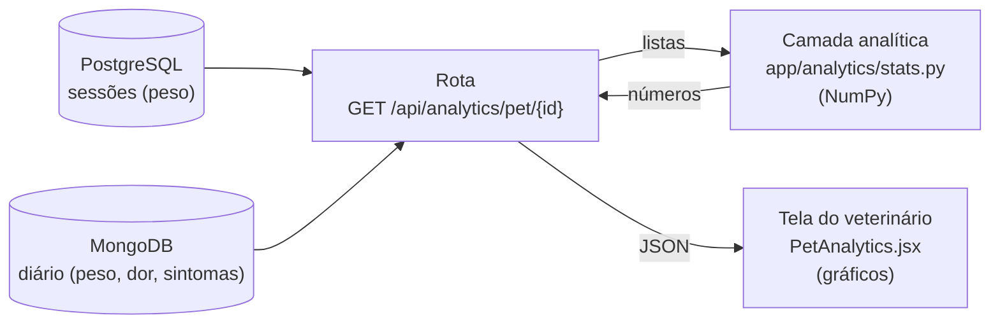

# Manual do NumPy no OncoPet (RF-05)

Este manual explica como o OncoPet usa o NumPy para calcular as estatísticas do tratamento: o que é calculado, como cada cálculo funciona (com exemplos que dá para conferir à mão), onde fica o código, como testar e como os resultados chegam aos gráficos.

> Os números dos exemplos foram gerados pelas próprias funções do projeto. Os do item 6 vêm da Luna nos dados de demonstração (`scripts/seed_demo.py`), com data de referência 28/09/2026.

## Sumário

1. [Visão geral](#1-visão-geral)
2. [Por que NumPy](#2-por-que-numpy)
3. [Onde fica o código](#3-onde-fica-o-código)
4. [Os cálculos, um por um](#4-os-cálculos-um-por-um)
5. [A rota da API](#5-a-rota-da-api)
6. [Exemplo real de resposta](#6-exemplo-real-de-resposta)
7. [Como a tela usa os resultados](#7-como-a-tela-usa-os-resultados)
8. [Testes](#8-testes)
9. [Como experimentar no terminal](#9-como-experimentar-no-terminal)
10. [Limites e decisões](#10-limites-e-decisões)
11. [Problemas comuns](#11-problemas-comuns)
12. [Glossário](#12-glossário)

---

## 1. Visão geral

O requisito **RF-05** pede que o backend em Python processe o histórico do paciente com NumPy e envie estatísticas para o frontend desenhar gráficos. Dois requisitos não funcionais completam o pedido:

- **RNF-01:** os cálculos devem usar **operações vetorizadas** do NumPy.
- **RNF-04:** as **rotas REST** devem ficar **separadas** da camada de cálculos.

O OncoPet calcula quatro coisas:

| Cálculo | Pergunta que responde |
|---|---|
| Tendência de peso | O pet está ganhando ou perdendo peso, e quanto por semana? |
| Média móvel | Qual é a direção geral, sem os altos e baixos de cada dia? |
| Dor recente × anterior | A dor piorou nas últimas 4 semanas? |
| Frequência de sintomas | Quais sintomas aparecem mais? |

O caminho dos dados:



---

## 2. Por que NumPy

**NumPy** é a biblioteca padrão do Python para cálculo com listas de números. O ponto principal é a **vetorização**: em vez de percorrer a lista item por item com um `for`, a operação é feita na lista inteira de uma vez.

Exemplo: somar 1 a cada peso.

```python
# Python puro: um laço, item por item
novos = []
for p in pesos:
    novos.append(p + 1)

# NumPy: uma operação sobre o array inteiro
novos = np.array(pesos) + 1
```

O resultado é o mesmo, mas a versão NumPy roda em código compilado (C) e fica muito mais rápida quando o histórico cresce, que é exatamente o que o RNF-01 pede. Também deixa o código mais curto e mais próximo da fórmula matemática.

Versão usada: `numpy==2.2.6` (em `backend/requirements.txt`).

---

## 3. Onde fica o código

| Arquivo | Papel |
|---|---|
| `backend/app/analytics/stats.py` | **Camada analítica.** Funções puras com NumPy: recebem listas e devolvem números. Não sabem nada de banco de dados, HTTP ou FastAPI. |
| `backend/app/analytics/__init__.py` | Explica o papel da camada. |
| `backend/app/routers/analytics.py` | **Rota** `GET /api/analytics/pet/{pet_id}`. Busca os dados nos dois bancos, chama as funções e monta a resposta. |
| `backend/app/schemas.py` | Formato da resposta (`PetAnalytics`, `WeightSummary`, `PainSummary`, `SymptomCount` e os pontos dos gráficos). |
| `backend/tests/test_analytics.py` | Testes dos cálculos e da rota. |
| `frontend/src/components/PetAnalytics.jsx` | Seção "Análise do tratamento" no prontuário (cartões e gráficos). |

Essa divisão é o que o **RNF-04** pede: se um dia os dados vierem de outro lugar, as funções de cálculo continuam iguais; e elas podem ser testadas sem subir banco nenhum.

Constantes no topo de `stats.py`:

| Constante | Valor | Uso |
|---|---|---|
| `SEVERE_PAIN` | `7` | A partir dessa nota a dor conta como **intensa**. |
| `RELEVANT_WEIGHT_LOSS` | `5.0` | Perda de peso (%) considerada **clinicamente relevante**. |

---

## 4. Os cálculos, um por um

### 4.1 `days_since_start(dates)`: datas viram números

Para fazer contas com datas, primeiro elas viram "dias desde a primeira data".

```python
datas = [01/09, 08/09, 15/09, 01/10]
days_since_start(datas)  →  [0, 7, 14, 30]
```

Cada data vira o número de dias do calendário (`toordinal`) e o NumPy subtrai o menor de todos de uma vez só: `ordinals - ordinals.min()`.

### 4.2 `moving_average(values, window=3)`: média móvel

Para cada ponto, calcula a média dele com os **2 registros anteriores** (janela de 3). Os primeiros pontos usam o que houver disponível.

```python
moving_average([4, 6, 8, 5, 3])  →  [4.0, 5.0, 6.0, 6.33, 5.33]
```

Conferindo à mão:

| Posição | Valores usados | Média |
|---|---|---|
| 1º | 4 | 4,0 |
| 2º | 4, 6 | 5,0 |
| 3º | 4, 6, 8 | 6,0 |
| 4º | 6, 8, 5 | 6,33 |
| 5º | 8, 5, 3 | 5,33 |

**Como é vetorizado.** Em vez de somar a janela de cada ponto num laço, usa-se a **soma acumulada** (`np.cumsum`):

```
valores          = [4,  6,  8, 5,  3]
soma acumulada   = [4, 10, 18, 23, 26]
soma 3 posições
atrás            = [0,  0,  0,  4, 10]
diferença        = [4, 10, 18, 19, 16]   ← soma de cada janela
quantos valores  = [1,  2,  3,  3,  3]
média            = [4,  5,  6, 6.33, 5.33]
```

A soma de uma janela é "soma acumulada até aqui" menos "soma acumulada até 3 posições atrás". Tudo feito com operações de array, sem laço.

É a **linha azul** dos gráficos de dor e de peso.

### 4.3 `weekly_trend(dates, values)`: tendência por semana

Traça a **reta que passa o mais perto possível** de todos os pontos (regressão linear, `np.polyfit(x, y, 1)`). A inclinação da reta é quanto o valor muda **por dia**; multiplicando por 7, **por semana**.

```python
datas = [01/09, 08/09, 15/09]
pesos = [20.0, 19.4, 18.8]
weekly_trend(datas, pesos)  →  -0.6   # perde 0,6 kg por semana
```

Por que regressão e não só "último menos primeiro": a regressão usa **todos** os pontos, então um registro fora da curva (uma balança errada, por exemplo) pesa menos no resultado.

Retorna `None` (sem tendência) quando há menos de 2 pontos ou quando todos são do mesmo dia.

### 4.4 `weight_stats(dates, weights)`: resumo do peso

```python
weight_stats([01/09, 08/09, 15/09], [20.0, 19.4, 18.8])
```

| Campo | Valor | Como é calculado |
|---|---|---|
| `first` / `last` | 20,0 / 18,8 | primeiro e último peso |
| `min` / `max` | 18,8 / 20,0 | `w.min()` / `w.max()` |
| `change_kg` | −1,2 | último − primeiro |
| `change_percent` | −6,0 | variação ÷ primeiro × 100 |
| `trend_kg_per_week` | −0,6 | `weekly_trend` |
| `relevant_loss` | `true` | variação ≤ −5% |
| `moving_average` | [20,0; 19,7; 19,4] | `moving_average` |

Na tela, `relevant_loss` vira o aviso **"Perda de peso relevante (5% ou mais)"**.

### 4.5 `pain_stats(dates, scores, today)`: resumo da dor

Separa os registros por "idade" (dias até a data de referência) usando **máscaras booleanas**, que são filtros aplicados ao array inteiro:

```python
idade    = hoje - data                         # array de dias
recentes = dor[idade < 28]                     # últimas 4 semanas
antes    = dor[(idade >= 28) & (idade < 56)]   # 4 semanas anteriores
```

Exemplo com 4 registros, de 50, 40, 10 e 3 dias atrás, com dores 2, 4, 6 e 8:

| Campo | Valor | Significado |
|---|---|---|
| `mean` | 5,0 | média de todos os registros |
| `last` / `max` | 8 / 8 | última nota e maior nota |
| `recent_mean` | 7,0 | média das últimas 4 semanas (6 e 8) |
| `previous_mean` | 3,0 | média das 4 semanas anteriores (2 e 4) |
| `recent_change` | +4,0 | recente − anterior (subiu = piorou) |
| `trend_per_week` | +0,77 | tendência pela regressão |
| `severe_percent` | 25,0 | % dos registros com dor ≥ 7 (só o 8) |
| `moving_average` | [2; 3; 4; 6] | média móvel |

O `severe_percent` também é vetorizado: `np.mean(dor >= 7) * 100`. A comparação `dor >= 7` gera um array de verdadeiro/falso, e a média de verdadeiros é a proporção.

Só entram registros em que a dor **foi avaliada** (`pain_score` diferente de `null`).

### 4.6 `symptom_frequency(listas, total)`: frequência de sintomas

Junta os sintomas de todos os registros e conta cada um com `np.unique(..., return_counts=True)`. Ordena do mais frequente para o menos frequente (em empate, ordem alfabética, com `np.lexsort`).

```python
symptom_frequency([["vomito", "letargia"], ["vomito"], []], total_logs=3)
→ vomito:   2 vezes, 66,7% dos registros
  letargia: 1 vez,   33,3% dos registros
```

A porcentagem é sobre **todos** os registros do diário, inclusive os sem sintoma.

---

## 5. A rota da API

`GET /api/analytics/pet/{pet_id}`

| | |
|---|---|
| **Quem pode** | Tutor dono do pet e veterinário responsável (mesma regra do prontuário). |
| **Parâmetro opcional** | `reference_date=AAAA-MM-DD`: data usada como "hoje" nas 4 semanas. Padrão: hoje. Útil em testes. |
| **Respostas** | 200 · 403 sem acesso · 404 pet não existe |

O que a rota faz, passo a passo (`app/routers/analytics.py`):

1. Confere se o pet existe e se o usuário pode vê-lo.
2. Busca as **sessões** no PostgreSQL (data e peso do dia da sessão).
3. Busca o **diário** no MongoDB (data, peso, dor, sintomas).
4. Monta a série de **peso** juntando sessões e diário, em ordem de data, e chama `weight_stats`.
5. Monta a série de **dor** só com os registros que têm dor avaliada e chama `pain_stats`.
6. Chama `symptom_frequency` com os sintomas do diário.
7. Devolve tudo num JSON: resumos e os pontos dos gráficos, cada ponto com a média móvel correspondente.

**Testar pelo terminal** (com o backend rodando):

```bash
TOKEN=$(curl -s -X POST localhost:8000/api/auth/login \
  -d "username=dra_ana&password=oncopet123" \
  | python3 -c "import sys,json;print(json.load(sys.stdin)['access_token'])")

curl -s "localhost:8000/api/analytics/pet/2" -H "Authorization: Bearer $TOKEN"
```

Ou pela documentação interativa: **http://localhost:8000/docs** → **Authorize** → `GET /api/analytics/pet/{pet_id}` → **Try it out**.

---

## 6. Exemplo real de resposta

Luna (pet 2) nos dados de demonstração, com `reference_date=2026-09-28`. As listas de pontos foram encurtadas para caber aqui:

```json
{
  "pet_id": 2,
  "reference_date": "2026-09-28",
  "logs_count": 14,
  "weight_points": [
    { "date": "2026-06-20", "weight": 29.3, "moving_average": 29.3 },
    { "date": "2026-06-23", "weight": 29.3, "moving_average": 29.3 }
  ],
  "weight": {
    "first": 29.3, "last": 28.3, "min": 28.3, "max": 29.5,
    "change_kg": -1.0, "change_percent": -3.4,
    "trend_kg_per_week": -0.075, "relevant_loss": false
  },
  "pain_points": [
    { "date": "2026-06-23", "pain": 5, "moving_average": 5.0 },
    { "date": "2026-06-30", "pain": 3, "moving_average": 4.0 }
  ],
  "pain": {
    "mean": 5.07, "last": 5, "max": 7,
    "recent_mean": 6.25, "previous_mean": 5.25, "recent_change": 1.0,
    "trend_per_week": 0.182, "severe_percent": 14.3
  },
  "symptoms": [
    { "symptom": "inapetencia", "count": 2, "percent": 14.3 },
    { "symptom": "letargia", "count": 1, "percent": 7.1 },
    { "symptom": "vomito", "count": 1, "percent": 7.1 }
  ]
}
```

Leitura clínica: a Luna perdeu 1 kg (3,4%), abaixo do limite de alerta de 5%. A dor média subiu de 5,25 para 6,25 nas últimas 4 semanas, com tendência de alta (+0,18 por semana). É o cenário esperado de um osteossarcoma progredindo.

---

## 7. Como a tela usa os resultados

O componente `frontend/src/components/PetAnalytics.jsx` aparece na aba **Dashboard** do prontuário do veterinário, na seção **"Análise do tratamento"**:

| Parte da tela | Dados usados |
|---|---|
| Cartão **Peso desde o início** | `weight.change_kg`, `change_percent`, `trend_kg_per_week` e o aviso quando `relevant_loss` |
| Cartão **Dor nas últimas 4 semanas** | `pain.recent_mean`, `recent_change`, `severe_percent` |
| Cartão **Sintoma mais frequente** | `symptoms[0]` |
| Gráfico **Escala de dor** | `pain_points` (dor e média móvel) e a linha tracejada em 7 |
| Gráfico **Evolução de peso** | `weight_points` (peso e média móvel) |
| **Frequência de sintomas** | `symptoms` (barras) |
| **Ver dados em tabela** | os mesmos pontos, em tabela |

Detalhes de visualização:

- **Cores validadas.** Verde `#0ca678` para o valor medido e azul `#3b5bdb` para a média móvel. O par passou no validador de paleta: contraste com o fundo branco e separação para daltonismo.
- **A direção nunca é mostrada só por cor.** Setas e texto acompanham o laranja e o verde ("+1 vs. 4 semanas anteriores").
- **Peso e dor ficam em gráficos separados**, cada um com um único eixo vertical. Misturar escalas diferentes no mesmo gráfico engana a leitura.
- A média móvel do gráfico de dor pode ser ligada e desligada.

---

## 8. Testes

Arquivo `backend/tests/test_analytics.py` (9 testes):

| Teste | O que confere |
|---|---|
| `test_media_movel_de_3_pontos` | `[1,2,3,4,5]` → `[1; 1,5; 2; 3; 4]` e lista vazia |
| `test_tendencia_semanal_por_regressao_linear` | perda de 0,1 kg/dia = −0,7 kg/semana; 1 ponto ou mesmo dia → sem tendência |
| `test_resumo_de_peso_e_perda_relevante` | −1,2 kg, −6%, alerta de perda relevante |
| `test_resumo_de_dor_compara_ultimas_4_semanas_com_as_anteriores` | médias 7 e 3, +4, 25% de dor intensa |
| `test_frequencia_de_sintomas` | contagem, % e ordem |
| `test_rota_junta_sessoes_do_relacional_e_diario_do_mongo` | a rota junta peso das sessões (Postgres) e do diário (Mongo) |
| `test_pet_sem_dados_nao_quebra` | pet sem registros devolve tudo vazio, sem erro |
| `test_permissoes` | outro tutor → 403; pet inexistente → 404 |
| `test_cenarios_dos_dados_de_demonstracao` | Thor perdendo peso; Luna com dor subindo |

Rodar:

```bash
cd backend && source .venv/bin/activate
pytest tests/test_analytics.py -q -p no:warnings   # só estes
pytest -q -p no:warnings                            # todos (60)
```

---

## 9. Como experimentar no terminal

Dá para chamar as funções direto no Python, sem subir o sistema:

```bash
cd backend && source .venv/bin/activate
python
```

```python
from datetime import date
from app.analytics.stats import moving_average, weekly_trend, weight_stats, symptom_frequency

moving_average([4, 6, 8, 5, 3])
# array([4.  , 5.  , 6.  , 6.333, 5.333])

weekly_trend([date(2026, 9, 1), date(2026, 9, 8), date(2026, 9, 15)], [20.0, 19.4, 18.8])
# -0.5999999999999974  → cerca de -0,6 kg por semana
# (conta com decimais tem essas "sobras"; weight_stats arredonda para -0.6)

weight_stats([date(2026, 9, 1), date(2026, 9, 15)], [10.0, 9.4])["relevant_loss"]
# True  (perdeu 6%)

symptom_frequency([["vomito"], ["vomito", "febre"], []], 3)
# [{'symptom': 'vomito', 'count': 2, 'percent': 66.7}, {'symptom': 'febre', ...}]
```

Para sair: `exit()`.

---

## 10. Limites e decisões

| Ponto | Explicação |
|---|---|
| Média móvel é por **registro**, não por dia | A janela usa os 3 últimos registros, independente do intervalo entre eles. Com registros semanais, equivale a ~3 semanas. |
| "Últimas 4 semanas" dependem da data de referência | Por padrão é o dia de hoje. Nos testes usa-se `reference_date` para o resultado não mudar conforme o dia em que o teste roda. |
| Peso junta duas fontes | O peso das sessões (PostgreSQL) e o do diário (MongoDB) entram na mesma série. Se os dois forem no mesmo dia, os dois pontos aparecem. |
| Algumas partes preparam dados em Python | Converter datas em números e juntar as listas de sintomas (cada registro tem uma quantidade diferente) exige percorrer os itens. **Os cálculos em si** (somas, médias, filtros, regressão, contagem) são vetorizados. |
| Tendência precisa de pelo menos 2 dias diferentes | Com menos, o campo vem `null` e a tela não mostra a tendência. |
| Arredondamento | Pesos com 2 casas, dor com 2 casas, porcentagens com 1 casa, tendências com 3 casas. |

---

## 11. Problemas comuns

| Sintoma | Causa provável | Solução |
|---|---|---|
| `ModuleNotFoundError: No module named 'numpy'` | Dependências não instaladas | `pip install -r requirements.txt` com o venv ativo |
| A seção "Análise do tratamento" não aparece | Backend não foi reiniciado depois de aplicar a mudança | Reiniciar o `uvicorn` e recarregar a página com Ctrl+Shift+R |
| Cartões mostram "Sem registros de peso" ou "Dor não avaliada" | O pet ainda não tem diário, ou o diário não tem dor | Registrar no diário (tutor) ou rodar `scripts/seed_demo.py` |
| Gráfico de dor não aparece | Menos de 2 registros com dor avaliada | É o esperado: um ponto só não forma linha |
| `403` na rota | Usuário sem acesso ao pet | Tutor só vê os próprios pets; vet só os atribuídos a ele |

---

## 12. Glossário

| Termo | Significado |
|---|---|
| **NumPy** | Biblioteca Python para cálculo numérico com arrays. |
| **Array** | Lista de números do NumPy, em que as operações valem para todos os itens de uma vez. |
| **Vetorização** | Fazer a operação no array inteiro em vez de item por item com um laço. |
| **Regressão linear** | Técnica que encontra a reta que passa mais perto de um conjunto de pontos. A inclinação indica a tendência. |
| **`np.polyfit`** | Função do NumPy que calcula a regressão (grau 1 = reta). |
| **Média móvel** | Média de uma "janela" que desliza sobre os dados; suaviza variações. |
| **`np.cumsum`** | Soma acumulada: cada posição tem a soma de todos os anteriores mais ele. |
| **Máscara booleana** | Array de verdadeiro/falso usado para filtrar outro array, como `dor[dor >= 7]`. |
| **`np.unique`** | Lista os valores distintos de um array e, opcionalmente, quantas vezes cada um aparece. |
| **Camada analítica** | Parte do código que só faz cálculos, separada das rotas da API (RNF-04). |
| **RF-05 / RNF-01 / RNF-04** | Requisitos da especificação: estatísticas com NumPy, vetorização e separação entre rotas e cálculos. |
