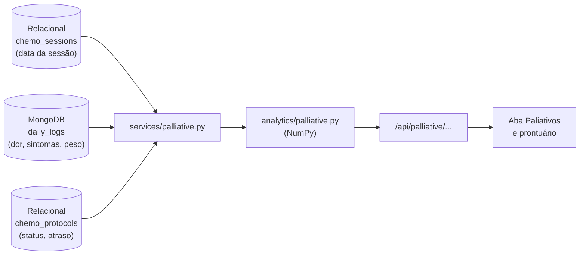

# Manual do painel de cuidados paliativos (RF-06)

Este manual explica o painel de cuidados paliativos: o que ele mostra, como cruza os dados dos dois bancos, quais regras geram cada alerta e como testar.

> Os exemplos do item 4 são os mesmos dos testes (`backend/tests/test_palliative.py`), então dá para conferir rodando o pytest. Os do item 6 vêm dos dados de demonstração (`scripts/seed_demo.py`).

## Sumário

1. [O que o requisito pede](#1-o-que-o-requisito-pede)
2. [Onde fica o código](#2-onde-fica-o-código)
3. [Como os dois bancos se cruzam](#3-como-os-dois-bancos-se-cruzam)
4. [Os cálculos, um por um](#4-os-cálculos-um-por-um)
5. [Alertas e níveis](#5-alertas-e-níveis)
6. [As rotas da API](#6-as-rotas-da-api)
7. [As telas](#7-as-telas)
8. [Testes](#8-testes)
9. [Limites e decisões](#9-limites-e-decisões)

---

## 1. O que o requisito pede

> **RF-06:** O sistema deve possuir um Dashboard de Cuidados Paliativos destacando métricas críticas extraídas da correlação entre o histórico do MongoDB e as sessões no MySQL.

No OncoPet isso virou:

- **Aba "Paliativos" do veterinário:** todos os pacientes dele, dos mais críticos aos estáveis, com os alertas de cada um e um gráfico comparando a dor logo após as sessões com a dor dos demais dias.
- **Seção "Cuidados paliativos" no prontuário:** os alertas do paciente e como ele tolerou cada sessão.

A pergunta central é: **como o pet fica nos dias seguintes à quimioterapia?** A resposta só existe cruzando os dois bancos: a data da sessão está no relacional e o que o tutor observou está no MongoDB.

---

## 2. Onde fica o código

| Arquivo | Papel |
|---|---|
| `backend/app/analytics/palliative.py` | **Cálculos** com NumPy: dias desde a última sessão, efeito pós-sessão, tolerância por sessão, alertas. Funções puras, sem banco nem HTTP. |
| `backend/app/services/patient_history.py` | Lê sessões (relacional) e diário (MongoDB). Usado também pelas estatísticas do RF-05. |
| `backend/app/services/palliative.py` | Junta os dados de um paciente e chama os cálculos. |
| `backend/app/routers/palliative.py` | Rotas `/api/palliative/overview` e `/api/palliative/pet/{id}`. |
| `backend/tests/test_palliative.py` | 9 testes. |
| `frontend/src/components/PalliativeDashboard.jsx` | Aba "Paliativos". |
| `frontend/src/components/SessionTolerance.jsx` | Seção no prontuário. |
| `frontend/src/palliative.js` | Textos e filtros da tela (com testes em `palliative.test.js`). |

A divisão segue o RNF-04: as rotas só buscam dados; quem calcula é `app/analytics`.

---

## 3. Como os dois bancos se cruzam



A chave que liga os dois bancos é o `pet_id`: o mesmo id da tabela `pets` aparece em cada documento do diário (RNF-03). Para o painel geral, a rota faz **uma consulta só** em cada banco para todos os pacientes do veterinário (`pet_id IN (...)` no relacional e `{"pet_id": {"$in": [...]}}` no Mongo) e depois separa por paciente.

---

## 4. Os cálculos, um por um

### 4.1 Dias desde a última sessão: `days_after_last_session`

Para cada registro do diário, quantos dias se passaram desde a sessão mais recente (no mesmo dia ou antes).

```
sessões:   dia 0 e dia 10
registros: dia -1, 0, 2, 9, 12
resultado:  NaN, 0, 2, 9, 2
```

- Dia −1: ainda não tinha sessão → `NaN` (vazio).
- Dia 12: a última sessão foi no dia 10 → 2.

**Como é vetorizado:** `np.searchsorted` procura, de uma vez, onde cada registro se encaixaria na lista ordenada de sessões. A posição anterior é a última sessão. Sem laço por registro.

### 4.2 Efeito pós-sessão: `post_session_effect`

Separa os registros em dois grupos com uma **máscara booleana**:

- **Pós-sessão:** do 1º ao 3º dia depois de uma sessão (`1 <= dias <= 3`). É quando os efeitos colaterais da quimio costumam aparecer.
- **Demais dias:** todo o resto.

E calcula, para cada grupo, a média de dor e a % de registros com algum sintoma.

Exemplo (sessão no dia 0):

| Registro | Dia | Dor | Sintomas | Grupo |
|---|---|---|---|---|
| 1 | 1 | 6 | 2 | pós-sessão |
| 2 | 2 | 4 | 1 | pós-sessão |
| 3 | 5 | 2 | 0 | demais |
| 4 | 8 | não avaliada | 0 | demais |

| | Registros | Dor média | Com sintomas |
|---|---|---|---|
| Pós-sessão | 2 | 5,0 | 100% |
| Demais dias | 2 | 2,0 | 0% |
| **Diferença** | | **+3,0** | **+100** |

O registro sem dor avaliada conta nos sintomas, mas fica fora da média de dor (vira `NaN` e é ignorado).

### 4.3 Tolerância de cada sessão: `session_tolerance`

Monta uma **matriz sessões × registros**: cada célula é `True` quando aquele registro caiu nos 3 dias depois daquela sessão.

```
             reg. dia 2   dia 7   dia 15   dia 16
sessão dia 0     True     False   False    False
sessão dia 14    False    False   True     True
sessão dia 28    False    False   False    False
```

Com a matriz, somas e máximos por linha (`axis=1`) dão, para todas as sessões de uma vez: quantos registros houve, a dor máxima e em quantos dias houve sintomas.

### 4.4 Regras de tolerância: `classify_tolerance`

| Tolerância | Regra |
|---|---|
| **Sem registro** | O tutor não registrou nada nos 3 dias seguintes. |
| **Ruim** | Dor 7 ou mais, **ou** febre, **ou** falta de ar (dispneia). Febre após quimio pode indicar neutropenia febril, que é urgência. |
| **Moderada** | Algum outro sintoma, **ou** dor 2 pontos acima da dor média do pet nos demais dias. |
| **Boa** | Nenhuma das anteriores. |

No exemplo do item 4.3 (dor normal do pet = 1): a sessão do dia 0 foi **boa** (dor 2, sem sintomas), a do dia 14 **ruim** (dor 8 e febre) e a do dia 28 ficou **sem registro**.

A comparação com a dor "normal" do pet existe porque um paciente com osteossarcoma pode ter dor 5 todo dia; para ele, dor 5 depois da sessão não é efeito da quimio.

---

## 5. Alertas e níveis

Cada paciente recebe uma lista de alertas. O **nível** do paciente é o do alerta mais grave; sem alertas, ele fica **estável**.

| Alerta | Nível | Regra | Limite (constante em `palliative.py`) |
|---|---|---|---|
| Dor intensa | Crítico | último registro com dor ≥ 7, ou média das últimas 4 semanas ≥ 7 | `SEVERE_PAIN = 7` |
| Perda de peso | Crítico | perdeu 5% ou mais desde o início | `RELEVANT_WEIGHT_LOSS = 5.0` |
| Sessão mal tolerada | Crítico | a última sessão com registro teve tolerância **ruim** | — |
| Dor subindo | Atenção | média das últimas 4 semanas ≥ 1 ponto acima das 4 anteriores | `PAIN_RISE_ALERT = 1.0` |
| Dor pós-sessão | Atenção | dor nos 3 dias após as sessões ≥ 1,5 ponto acima dos demais dias | `POST_SESSION_PAIN_ALERT = 1.5` |
| Efeitos colaterais | Atenção | 2 ou mais das 3 últimas sessões com tolerância moderada ou ruim | `RECENT_SESSIONS = 3` |
| Diário parado | Atenção | tutor sem registrar há 10 dias ou mais (ou nunca registrou) | `STALE_DIARY_DAYS = 10` |
| Sessão atrasada | Atenção | a próxima sessão prevista do protocolo já passou | regra do RF-04 |
| Protocolo suspenso | Atenção | protocolo com status *suspenso* | — |

No painel, os pacientes aparecem nesta ordem: **crítico → atenção → estável**; no mesmo nível, quem tem mais alertas e mais dor recente vem primeiro.

Os limites são escolhas do projeto para a demonstração, não protocolo clínico. Ficam em constantes no topo do arquivo para serem fáceis de ajustar.

---

## 6. As rotas da API

### `GET /api/palliative/overview`

Todos os pacientes do veterinário logado, já ordenados. **Só veterinário** (tutor recebe 403).

Resumo da resposta com os dados de demonstração (Dra. Ana):

```json
{
  "reference_date": "2026-09-28",
  "critico": 1, "atencao": 4, "estavel": 2,
  "patients": [
    {
      "name": "Bela", "level": "critico",
      "last_pain": 6, "recent_pain_mean": 7.0, "pain_recent_change": 2.33,
      "weight_change_percent": -5.5, "days_since_last_log": 18, "sessions_count": 3,
      "pain_after_session": 6.0, "pain_other_days": 5.33,
      "alerts": [
        { "level": "critico", "code": "dor_intensa", "message": "Dor média de 7 nas últimas 4 semanas" },
        { "level": "critico", "code": "perda_peso", "message": "Perdeu 5,5% do peso desde o início" },
        { "level": "critico", "code": "sessao_mal_tolerada", "message": "Sessão de 31/08 mal tolerada: dor 8/10, febre" },
        { "level": "atencao", "code": "dor_subindo", "message": "Dor subiu 2,3 ponto(s) em relação às 4 semanas anteriores" },
        { "level": "atencao", "code": "diario_parado", "message": "Sem registro do tutor há 18 dias" }
      ]
    }
  ]
}
```

> A Bela é um caso criado no seed justamente para o painel: dor alta, perda de peso, febre depois de uma sessão e tutor sem registrar há quase 3 semanas. As datas mudam conforme o dia em que o seed roda.

### `GET /api/palliative/pet/{pet_id}`

Alertas do paciente, efeito pós-sessão e a tolerância de cada sessão. Mesmo acesso do prontuário: o tutor dono e o veterinário responsável.

```json
{
  "level": "critico",
  "effect": {
    "window_days": 3,
    "after_session": { "logs": 2, "pain_mean": 6.0, "symptom_percent": 50.0 },
    "other_days": { "logs": 3, "pain_mean": 5.33, "symptom_percent": 0.0 },
    "pain_difference": 0.67, "symptom_difference": 50.0
  },
  "sessions": [
    { "date": "2026-08-10", "drug_name": "Mitoxantrona", "logs": 1, "max_pain": 4, "symptoms": [], "tolerance": "boa" },
    { "date": "2026-08-31", "drug_name": "Mitoxantrona", "logs": 1, "max_pain": 8, "symptoms": ["febre", "letargia"], "tolerance": "ruim" },
    { "date": "2026-09-21", "drug_name": "Mitoxantrona", "logs": 0, "max_pain": null, "symptoms": [], "tolerance": "sem_dados" }
  ]
}
```

As duas rotas aceitam `?reference_date=AAAA-MM-DD` para fixar o "hoje" (registros e sessões depois dessa data são ignorados).

**Testar pelo terminal** (backend rodando, depois do seed):

```bash
TOKEN=$(curl -s -X POST localhost:8000/api/auth/login \
  -d "username=dra_ana&password=oncopet123" \
  | python3 -c "import sys,json;print(json.load(sys.stdin)['access_token'])")

curl -s localhost:8000/api/palliative/overview -H "Authorization: Bearer $TOKEN" | python3 -m json.tool
```

Ou em **http://localhost:8000/docs**, grupo **cuidados paliativos**.

---

## 7. As telas

### Aba "Paliativos" (veterinário, `/paliativos`)

- **Três contadores** (Críticos, Em atenção, Estáveis). Clicar filtra a lista; clicar de novo mostra todos.
- **Um cartão por paciente** com nível, dor das últimas 4 semanas (com seta de direção), variação de peso, último registro do tutor, número de sessões e a lista de alertas. Clicar no cabeçalho abre o prontuário.
- **Gráfico "Dor logo após as sessões × demais dias"**: barras horizontais, uma dupla por paciente, escala 0 a 10. Só entram pacientes com os dois valores; a tela avisa quantos ficaram de fora e por quê. Tem a tabela com os mesmos dados em "Ver dados em tabela".

### Prontuário (aba Dashboard)

Seção **Cuidados paliativos**, acima da análise do tratamento: nível do paciente, alertas, dois cartões comparando dor e sintomas após as sessões com os demais dias, e a lista **Tolerância a cada sessão** (da mais recente para a mais antiga).

### Acessibilidade

- Nível e tolerância sempre com **ícone + texto**, nunca só cor.
- As cores das barras são as mesmas já validadas no RF-05 (`#0ca678` e `#3b5bdb`).
- Os contadores são botões com `aria-pressed`, então o leitor de tela diz se o filtro está ligado.

---

## 8. Testes

`backend/tests/test_palliative.py` (9 testes):

| Teste | O que confere |
|---|---|
| `test_dias_desde_a_ultima_sessao` | o exemplo do item 4.1 |
| `test_efeito_pos_sessao_compara_com_os_demais_dias` | o exemplo do item 4.2 |
| `test_tolerancia_de_cada_sessao` | o exemplo do item 4.3 |
| `test_regras_de_tolerancia` | cada linha da tabela do item 4.4 |
| `test_alertas_e_nivel` | alertas, ordem (críticos primeiro), mensagem em português, nível |
| `test_paciente_cruza_sessoes_e_diario` | rota do paciente juntando sessão (relacional) e diário (Mongo) |
| `test_permissoes` | tutor não vê o painel geral; outro tutor não vê o pet; pet inexistente → 404 |
| `test_pet_sem_dados` | paciente sem diário aparece em atenção com "ainda não fez nenhum registro" |
| `test_painel_com_dados_de_demonstracao` | ordem por nível e a Bela como caso mais crítico |

No frontend, `src/palliative.test.js` testa filtros e textos (`npm test`).

```bash
cd backend && source .venv/bin/activate
pytest tests/test_palliative.py -q -p no:warnings
```

---

## 9. Limites e decisões

| Ponto | Explicação |
|---|---|
| Janela de 3 dias | Fixa (`POST_SESSION_DAYS`). Alguns medicamentos têm efeitos mais tardios (a queda de neutrófilos da doxorrubicina, por exemplo, é por volta do 7º–10º dia). |
| Registro no mesmo dia da sessão | Não entra na janela pós-sessão: o tutor pode ter registrado antes da aplicação. |
| Pacientes sem "demais dias" | Se todos os registros caíram logo após sessões (diário semanal + sessão semanal), não há com o que comparar. A tela avisa em vez de mostrar zero. |
| Seed | Ganhou a **Bela** (pedro / Dra. Ana). Ela foi adicionada no fim da lista, então os dados dos outros pets não mudaram. |
| Diário parado | Conta a partir do último registro até a data de referência; com o diário semanal do seed, até 7 dias é normal. |
