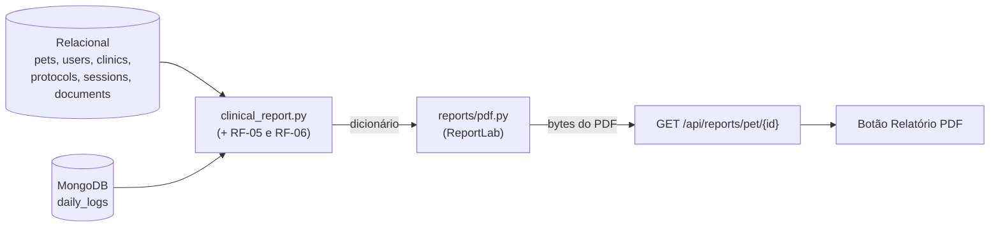

# Manual do relatório clínico em PDF (RF-07)

Este manual explica o relatório clínico: o que vai em cada parte, de onde vem cada dado, como gerar e como testar.

## Sumário

1. [O que o requisito pede](#1-o-que-o-requisito-pede)
2. [Onde fica o código](#2-onde-fica-o-código)
3. [O que tem no relatório](#3-o-que-tem-no-relatório)
4. [A rota da API](#4-a-rota-da-api)
5. [O botão nas telas](#5-o-botão-nas-telas)
6. [Decisões de implementação](#6-decisões-de-implementação)
7. [Testes](#7-testes)
8. [Problemas comuns](#8-problemas-comuns)

---

## 1. O que o requisito pede

> **RF-07:** O sistema deve exportar relatórios clínicos unificados em formato PDF.

"Unificado" quer dizer que o PDF junta, num documento só, o que está espalhado pelo sistema:

- **banco relacional:** paciente, tutor, veterinário, clínica, protocolos, sessões, documentos;
- **MongoDB:** diário do tutor (dor, sintomas, peso, observações);
- **RF-05:** estatísticas calculadas com NumPy;
- **RF-06:** nível do paciente, alertas e tolerância de cada sessão.

---

## 2. Onde fica o código

| Arquivo | Papel |
|---|---|
| `backend/app/services/clinical_report.py` | **Junta os dados** dos dois bancos e das camadas de análise num dicionário simples (só textos e números). |
| `backend/app/reports/pdf.py` | **Desenha o PDF** com ReportLab a partir desse dicionário. Não acessa banco. |
| `backend/app/routers/reports.py` | Rota `GET /api/reports/pet/{id}`. |
| `backend/tests/test_reports.py` | 7 testes. |
| `frontend/src/components/ReportButton.jsx` | Botão **Relatório PDF**. |
| `frontend/src/report.js` | Faz o download com o token de login (com teste em `report.test.js`). |

A separação em "juntar dados" e "desenhar" segue a mesma ideia do RNF-04: dá para testar o desenho sem banco e trocar a fonte dos dados sem mexer no PDF.



---

## 3. O que tem no relatório

Página A4, com cabeçalho "OncoPet · Relatório clínico" e rodapé "Página X de Y" em todas as páginas.

| Parte | Conteúdo | Origem |
|---|---|---|
| Título | Nome do pet, diagnóstico, data de emissão e "dados até" | relacional |
| 1. Identificação | Espécie, raça, idade, peso, superfície corporal, início do tratamento; tutor, veterinário (CRMV), clínica; total de sessões e registros | relacional + contagem do Mongo |
| 2. Situação atual | Nível (Crítico, Atenção, Estável) e lista de alertas; dor e sintomas após as sessões × demais dias | RF-06 |
| 3. Protocolos | Nome, medicamento e dose, sessões feitas de planejadas, início, status, próxima sessão (marca "atrasada") | relacional (RF-04) |
| 4. Evolução | Três cartões (peso desde o início, dor das últimas 4 semanas, sintoma mais frequente), gráficos de dor e de peso com média móvel, frequência de sintomas | RF-05 |
| 5. Sessões | Data, medicamento, dose (mg/m² e mg aplicados), peso e tolerância de cada sessão | relacional + RF-06 |
| 6. Diário do tutor | Os 12 registros mais recentes: dor, peso, sintomas, estado, apetite, energia e observações | MongoDB |
| 7. Exames e documentos | Data, título e tipo | relacional |

Partes sem dados não quebram o relatório: protocolos, sessões e documentos somem se estiverem vazios, e o diário mostra "O tutor ainda não fez registros no diário".

Os níveis e a tolerância aparecem **escritos** ("CRÍTICO", "Ruim"), não só coloridos, para o relatório funcionar impresso em preto e branco.

---

## 4. A rota da API

`GET /api/reports/pet/{pet_id}`

| | |
|---|---|
| **Quem pode** | Tutor dono do pet e veterinário responsável (mesma regra do prontuário). |
| **Parâmetro opcional** | `reference_date=AAAA-MM-DD`: considera os dados até essa data. Padrão: hoje. |
| **Resposta** | `200` com `Content-Type: application/pdf` e `Content-Disposition: attachment; filename="relatorio-luna-2026-09-30.pdf"` · `401` sem login · `403` sem acesso · `404` pet não existe |

O nome do arquivo tira acentos e espaços do nome do pet ("Pé de Moleque" → `relatorio-pe-de-moleque-...pdf`).

**Testar pelo terminal** (backend rodando, depois do seed):

```bash
TOKEN=$(curl -s -X POST localhost:8000/api/auth/login \
  -d "username=dra_ana&password=oncopet123" \
  | python3 -c "import sys,json;print(json.load(sys.stdin)['access_token'])")

curl -s localhost:8000/api/reports/pet/2 -H "Authorization: Bearer $TOKEN" -o luna.pdf
xdg-open luna.pdf
```

Pela documentação interativa (**http://localhost:8000/docs**, grupo **relatorios**), o "Try it out" mostra um link **Download file**.

---

## 5. O botão nas telas

- **Veterinário:** no cabeçalho do prontuário (`/pacientes/:id`), à direita.
- **Tutor:** no cabeçalho do diário do pet (`/animais/:id`).
- No celular, o botão ocupa a largura toda, abaixo do nome do pet.

Enquanto o PDF é gerado, o botão mostra "Gerando…" e fica desabilitado. Se der erro, aparece a mensagem "Não foi possível gerar o relatório".

**Por que o download passa pelo JavaScript?** A rota exige o token de login no cabeçalho `Authorization`. Um link comum (`<a href>`) não manda esse cabeçalho, então `report.js` baixa o PDF com o `axios` (que já coloca o token), cria um link temporário para o arquivo e clica nele.

---

## 6. Decisões de implementação

| Decisão | Motivo |
|---|---|
| **ReportLab** (`reportlab==4.4.4`) | Biblioteca Python pura: instala com `pip` e não precisa de programas do sistema (o WeasyPrint precisaria de Pango/Cairo). Os gráficos também saem do próprio ReportLab, em vetor, sem matplotlib. |
| Fonte Helvetica (padrão do PDF) | Não precisa embutir arquivo de fonte. Ela tem os acentos do português, mas não tem alguns símbolos: `clean()` troca `−` por `-` e `≥` por `>=`, e transforma `²` em expoente. |
| Textos do usuário escapados | Observações do tutor passam por `clean()`, que escapa `<`, `>` e `&`, para um texto como "<b>" não virar formatação. |
| Mesmas cores do app | Verde `#0ca678` para o valor e azul `#3b5bdb` para a média móvel, as mesmas dos gráficos da tela. A linha laranja tracejada marca dor intensa (7). |
| "Página X de Y" | O total só é conhecido no fim, então o `_NumberedCanvas` guarda as páginas e escreve cabeçalho e rodapé quando o documento termina. |
| Diário limitado a 12 registros | Mantém o relatório em 2 ou 3 páginas; o histórico completo continua nos gráficos e na tela. |

---

## 7. Testes

`backend/tests/test_reports.py` (7 testes; usam `pypdf` para ler o texto do PDF gerado):

| Teste | O que confere |
|---|---|
| `test_formatacao_brasileira` | números com vírgula e lista de sintomas em português |
| `test_texto_seguro_para_o_pdf` | escape de marcação, troca de símbolos, `²` |
| `test_nome_do_arquivo` | nome sem acento nem espaço |
| `test_relatorio_minimo_sem_historico` | pet sem nenhum dado gera PDF sem erro |
| `test_rota_gera_pdf_com_dados_dos_dois_bancos` | o PDF tem dados do relacional (pet, tutor, sessão) e do Mongo (observação e dor do diário), mais a tolerância e o alerta |
| `test_permissoes` | tutor dono 200, outro tutor 403, pet inexistente 404, sem login 401 |
| `test_relatorio_dos_dados_de_demonstracao` | relatório da Luna com protocolo atrasado, tutora, CRMV, exame e numeração de páginas |

```bash
cd backend && source .venv/bin/activate
pip install -r requirements-dev.txt     # instala reportlab e pypdf
pytest tests/test_reports.py -q -p no:warnings
```

---

## 8. Problemas comuns

| Sintoma | Causa provável | Solução |
|---|---|---|
| `ModuleNotFoundError: No module named 'reportlab'` | Dependência nova não instalada | `pip install -r requirements.txt` (ou `requirements-dev.txt`, que inclui o `pypdf` dos testes) com o venv ativo |
| Botão mostra "Não foi possível gerar o relatório" | Backend parado ou sem reiniciar depois de instalar o ReportLab | Reiniciar o `uvicorn` e tentar de novo |
| Algum caractere aparece como `?` no PDF | Símbolo fora dos caracteres da Helvetica (emoji, por exemplo) | Esperado: o `clean()` troca por `?` em vez de quebrar o PDF |
| PDF com dados "antigos" | `reference_date` passado na URL | Sem o parâmetro, usa a data de hoje |
